# Technical Architecture Documentation

> **Document Purpose**: This document provides code-level technical details of how all components in the AjarinAja (classroom-companion) application interact with each other. It's designed to help developers (including future-you) quickly understand the system architecture without confusion.

> **Last Updated**: February 4, 2026

---

## Table of Contents

1. [System Overview](#system-overview)
2. [Frontend Architecture](#frontend-architecture)
3. [Component Hierarchy](#component-hierarchy)
4. [Custom Hooks System](#custom-hooks-system)
5. [Context Providers](#context-providers)
6. [Routing & Navigation](#routing--navigation)
7. [State Management Patterns](#state-management-patterns)
8. [Form Handling Architecture](#form-handling-architecture)
9. [Key User Flows](#key-user-flows)

---

## System Overview

AjarinAja is a full-stack Learning Management System built with a modern React frontend and Supabase backend. The application follows a **component-based architecture** with clear separation of concerns.

### High-Level Architecture

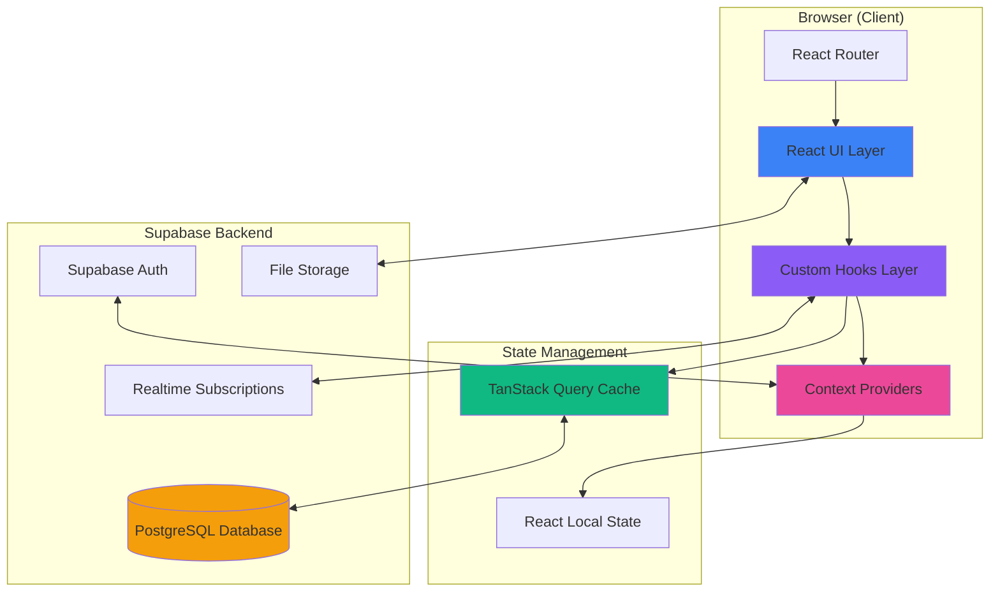
```mermaid
flowchart TB
    subgraph Browser["Browser (Client)"]
        UI[React UI Layer]
        Hooks[Custom Hooks Layer]
        Context[Context Providers]
        Router[React Router]
    end
    
    subgraph State["State Management"]
        TanStack[TanStack Query Cache]
        LocalState[React Local State]
    end
    
    subgraph Backend["Supabase Backend"]
        Auth[Supabase Auth]
        DB[(PostgreSQL Database)]
        Storage[File Storage]
        Realtime[Realtime Subscriptions]
    end
    
    UI --> Hooks
    Hooks --> TanStack
    Hooks --> Context
    Router --> UI
    Context --> LocalState
    
    TanStack <--> DB
    Auth <--> Context
    Hooks <--> Realtime
    UI <--> Storage
    
    style UI fill:#3b82f6
    style Hooks fill:#8b5cf6
    style Context fill:#ec4899
    style TanStack fill:#10b981
    style DB fill:#f59e0b
```

### Technology Stack Summary

| Layer | Technology | Purpose |
|-------|-----------|---------|
| **UI Components** | React 18 + TypeScript | Component-based UI |
| **UI Library** | shadcn/ui (Radix UI) | Pre-built accessible components |
| **Routing** | React Router v6 | Client-side navigation |
| **State Management** | TanStack Query v5 | Server state caching & sync |
| **Form Handling** | React Hook Form + Zod | Form validation & state |
| **Backend** | Supabase | Auth, Database, Storage, Realtime |
| **Database** | PostgreSQL | Relational data storage |

---

## Frontend Architecture

The frontend is organized into distinct layers with clear responsibilities:

### Directory Structure

```
src/
├── components/          # Reusable UI components (65+ components)
│   ├── ui/             # shadcn/ui base components (49)
│   ├── dashboard/      # Dashboard widgets
│   ├── attendance/     # Attendance-specific components
│   └── *.tsx           # Shared components (NotificationBell, ProtectedRoute, etc.)
├── contexts/           # React Context providers
│   ├── AuthContext.tsx
│   ├── DemoContext.tsx
│   └── SidebarContext.tsx
├── hooks/              # Custom React hooks (38 hooks)
│   ├── useCourses.ts
│   ├── useExams.ts
│   ├── useAssignments.ts
│   └── ...
├── layouts/            # Layout wrappers
│   ├── TeacherLayout.tsx
│   ├── StudentLayout.tsx
│   └── DemoLayout.tsx
├── pages/              # Page components (69 pages)
│   ├── teacher/        # Teacher pages (23)
│   ├── student/        # Student pages (20)
│   ├── demo/           # Demo pages (30)
│   └── *.tsx           # Public pages
├── integrations/       # Third-party integrations
│   └── supabase/       # Supabase client & types
├── lib/                # Utility functions
├── i18n/               # Internationalization config
└── types/              # TypeScript type definitions
```

### Component Organization Strategy

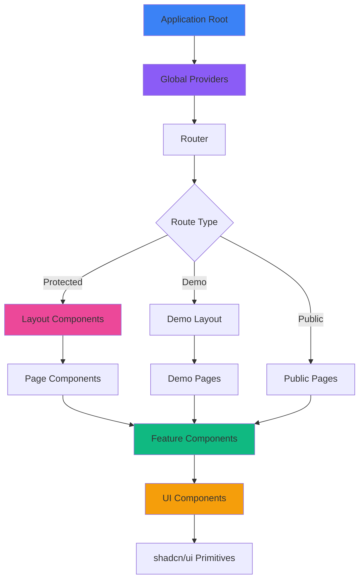
```mermaid
graph TD
    A[Application Root] --> B[Global Providers]
    B --> C[Router]
    C --> D{Route Type}
    
    D -->|Protected| E[Layout Components]
    D -->|Public| F[Public Pages]
    D -->|Demo| G[Demo Layout]
    
    E --> H[Page Components]
    G --> I[Demo Pages]
    
    H --> J[Feature Components]
    I --> J
    F --> J
    
    J --> K[UI Components]
    K --> L[shadcn/ui Primitives]
    
    style A fill:#3b82f6
    style B fill:#8b5cf6
    style E fill:#ec4899
    style J fill:#10b981
    style K fill:#f59e0b
```

**Component Hierarchy Explanation:**

1. **Application Root** ([main.tsx](https://github.com/lil-id/classroom-companion/blob/main/src/main.tsx)) - Mounts React app
2. **Global Providers** ([App.tsx](https://github.com/lil-id/classroom-companion/blob/main/src/App.tsx)) - QueryClient, Auth, Tooltips, Toaster
3. **Router** - React Router with route definitions
4. **Layouts** - TeacherLayout, StudentLayout, DemoLayout (contain sidebar, navigation)
5. **Pages** - Main page components for each route
6. **Feature Components** - Business logic components (CoursePreviewModal, MaterialViewer, etc.)
7. **UI Components** - Pure presentational components (shadcn/ui)

---

## Component Hierarchy

### Application Entry Point

The application bootstraps through a provider hierarchy:

```tsx
// main.tsx - Application Entry Point
createRoot(document.getElementById("root")!).render(<App />);

// App.tsx - Provider Hierarchy
<QueryClientProvider>          {/* TanStack Query cache */}
  <AuthProvider>                {/* Authentication state */}
    <TooltipProvider>           {/* UI tooltips */}
      <Toaster />               {/* Toast notifications */}
      <BrowserRouter>           {/* Client-side routing */}
        <Routes>
          {/* Route definitions */}
        </Routes>
      </BrowserRouter>
    </TooltipProvider>
  </AuthProvider>
</QueryClientProvider>
```

**Provider Initialization Order:**

1. **QueryClientProvider** - Must be outermost to provide cache to all components
2. **AuthProvider** - Provides authentication state globally
3. **TooltipProvider** - Enables tooltip functionality
4. **BrowserRouter** - Enables routing

> [!IMPORTANT]
> The order of providers matters! QueryClient must wrap AuthProvider because auth hooks use TanStack Query for data fetching.

### Layout Components

Each user role has a dedicated layout with sidebar navigation:

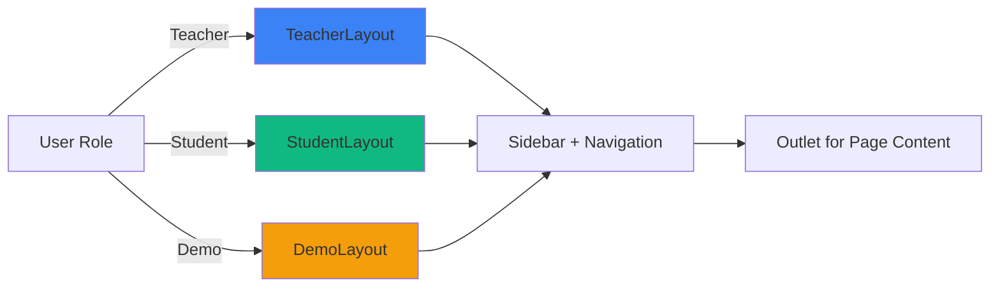
```mermaid
graph LR
    A[User Role] -->|Teacher| B[TeacherLayout]
    A -->|Student| C[StudentLayout]
    A -->|Demo| D[DemoLayout]
    
    B --> E[Sidebar + Navigation]
    C --> E
    D --> E
    
    E --> F[Outlet for Page Content]
    
    style B fill:#3b82f6
    style C fill:#10b981
    style D fill:#f59e0b
```

**Layout Component Structure:**

```tsx
// TeacherLayout.tsx structure
TeacherLayout
├── SidebarProvider                    // Manages sidebar open/closed state
│   ├── Header                         // Top navigation bar
│   │   ├── Logo
│   │   ├── LanguageSwitcher
│   │   └── Profile Menu
│   ├── Sidebar                        // Navigation sidebar
│   │   ├── Navigation Items
│   │   │   ├── Overview (Dashboard)
│   │   │   ├── Courses
│   │   │   ├── Exams
│   │   │   ├── Assignments
│   │   │   ├── Students
│   │   │   ├── Materials
│   │   │   ├── Analytics
│   │   │   ├── Calendar
│   │   │   └── Settings
│   │   └── Logout Button
│   └── Main Content Area
│       └── <Outlet />                 // Child route renders here
```

**Code Reference:**
- [TeacherLayout.tsx](https://github.com/lil-id/classroom-companion/blob/main/src/layouts/TeacherLayout.tsx#L38-L238)
- [StudentLayout.tsx](https://github.com/lil-id/classroom-companion/blob/main/src/layouts/StudentLayout.tsx#L38-L240)
- [DemoLayout.tsx](https://github.com/lil-id/classroom-companion/blob/main/src/layouts/DemoLayout.tsx)

### Shared Components

The application has 18 shared components in `/src/components/`:

| Component | Purpose | Used By |
|-----------|---------|---------|
| [ProtectedRoute.tsx](https://github.com/lil-id/classroom-companion/blob/main/src/components/ProtectedRoute.tsx) | Route authentication & authorization | App.tsx routing |
| [NotificationBell.tsx](https://github.com/lil-id/classroom-companion/blob/main/src/components/NotificationBell.tsx) | Real-time notification widget | Student/Teacher layouts |
| [LanguageSwitcher.tsx](https://github.com/lil-id/classroom-companion/blob/main/src/components/LanguageSwitcher.tsx) | i18n language toggle | All layouts |
| [MaterialViewer.tsx](https://github.com/lil-id/classroom-companion/blob/main/src/components/MaterialViewer.tsx) | PDF/Video viewer | Course materials pages |
| [FormulaInput.tsx](https://github.com/lil-id/classroom-companion/blob/main/src/components/FormulaInput.tsx) | Math formula editor (KaTeX) | Exam/Assignment creation |
| [AvatarUpload.tsx](https://github.com/lil-id/classroom-companion/blob/main/src/components/AvatarUpload.tsx) | Profile picture upload | Profile pages |
| [CoursePreviewModal.tsx](https://github.com/lil-id/classroom-companion/blob/main/src/components/CoursePreviewModal.tsx) | Course detail modal | Course listings |
| [DemoTour.tsx](https://github.com/lil-id/classroom-companion/blob/main/src/components/DemoTour.tsx) | Interactive demo walkthrough | Demo pages |

### UI Component Library (shadcn/ui)

The app uses **49 shadcn/ui components** located in `/src/components/ui/`. These are built on Radix UI primitives:

**Common Components:**
- Form elements: `button`, `input`, `textarea`, `select`, `checkbox`, `radio-group`
- Layout: `card`, `separator`, `scroll-area`, `sheet`, `drawer`
- Feedback: `toast`, `alert`, `alert-dialog`, `skeleton`
- Navigation: `tabs`, `dropdown-menu`, `navigation-menu`, `breadcrumb`
- Data display: `table`, `badge`, `avatar`, `progress`, `chart`

---

## Custom Hooks System

The application has **38 custom hooks** that encapsulate data fetching, state management, and business logic. All hooks follow a consistent pattern using TanStack Query.

### Hook Architecture Pattern

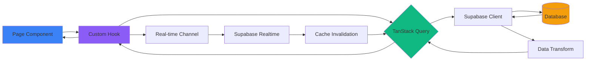
```mermaid
flowchart LR
    A[Page Component] --> B[Custom Hook]
    B --> C{TanStack Query}
    C --> D[Supabase Client]
    D --> E[(Database)]
    
    E --> D
    D --> F[Data Transform]
    F --> C
    C --> B
    B --> A
    
    B --> G[Real-time Channel]
    G --> H[Supabase Realtime]
    H --> I[Cache Invalidation]
    I --> C
    
    style A fill:#3b82f6
    style B fill:#8b5cf6
    style C fill:#10b981
    style E fill:#f59e0b
```

### Standard Hook Pattern

Every data-fetching hook follows this structure:

```tsx
// Example: useCourses hook
export function useCourses() {
  const { user } = useAuth();                    // 1. Get auth context
  const queryClient = useQueryClient();          // 2. Get query client
  
  // 3. Define query with useQuery
  const { data: courses = [], isLoading, error } = useQuery({
    queryKey: ['courses'],                       // Unique cache key
    queryFn: async () => {                       // Fetch function
      // 3a. Fetch from Supabase
      const { data, error } = await supabase
        .from('courses')
        .select('*')
        .order('created_at', { ascending: false });
      
      if (error) throw error;
      
      // 3b. Transform data if needed
      return data as Course[];
    },
    enabled: !!user,                             // Only run when authenticated
  });
  
  // 4. Set up real-time subscription
  useEffect(() => {
    if (!user) return;
    
    const channel = supabase
      .channel('courses-changes')
      .on('postgres_changes', {
        event: '*',                              // Listen to all changes
        schema: 'public',
        table: 'courses',
      }, () => {
        // 4a. Invalidate cache on changes
        queryClient.invalidateQueries({ queryKey: ['courses'] });
      })
      .subscribe();
    
    return () => {
      supabase.removeChannel(channel);
    };
  }, [user, queryClient]);
  
  // 5. Return data and states
  return { courses, isLoading, error };
}
```

**Code Reference:** [useCourses.ts](https://github.com/lil-id/classroom-companion/blob/main/src/hooks/useCourses.ts#L31-L105)

### Hook Categories

The 38 hooks are organized by domain:

#### Course Management Hooks (3)
- `useCourses` - Fetch all courses with teacher data
- `useTeacherCourses` - Fetch courses by teacher ID
- `useStudentCourses` - Fetch enrolled courses for student
- `useCourseMetrics` - Course analytics and metrics
- `useCourseMaterials` - Course learning materials

#### Assessment Hooks (7)
- `useExams` - Fetch exams (optionally by course)
- `useExamResults` - Student exam results
- `useAssignments` - Assignment management
- `useAssignmentQuestions` - Assignment question details
- `useSubmissions` - Assignment submissions
- `useQuestions` - Exam questions
- `useQuestionBank` - Reusable question library

#### User & Enrollment Hooks (4)
- `useProfile` - User profile data
- `useEnrollments` - Course enrollments
- `useBadges` - Achievement badges
- `useNotifications` - User notifications

#### Analytics & Tracking Hooks (8)
- `useActivityStats` - Teacher activity statistics
- `useStudentActivityStats` - Student activity stats
- `useProgress` - Student progress tracking
- `usePendingGrading` - Items awaiting grading
- `useRecentSubmissions` - Recent student submissions
- `useStudentRecentActivity` - Student recent activities
- `useStudentWaitingGrading` - Student pending grades
- `useAtRiskStudents` - At-risk student detection

#### Attendance Hooks (4)
- `useAttendanceSessions` - Attendance session management
- `useAttendanceMatrix` - Attendance data matrix
- `useStudentAttendance` - Student attendance records
- `useAttendanceSettings` - Attendance configuration
- `useAttendanceExport` - Export attendance data

#### Content & Communication Hooks (4)
- `useAnnouncements` - Course announcements
- `useCalendarEvents` - Calendar events
- `useReportCards` - Student report cards
- `useAIMaterials` - AI-generated materials

#### Other Hooks (8)
- `useAcademicPeriods` - Semester/term management
- `useRiskSettings` - At-risk detection criteria
- `useQuestionGeneration` - AI question generation
- `useQuickActionBadges` - Quick action badges
- `use-mobile` - Mobile responsive detection
- `use-toast` - Toast notification system
- `useScrollAnimation` - Scroll reveal animations

### Hook Dependency Graph

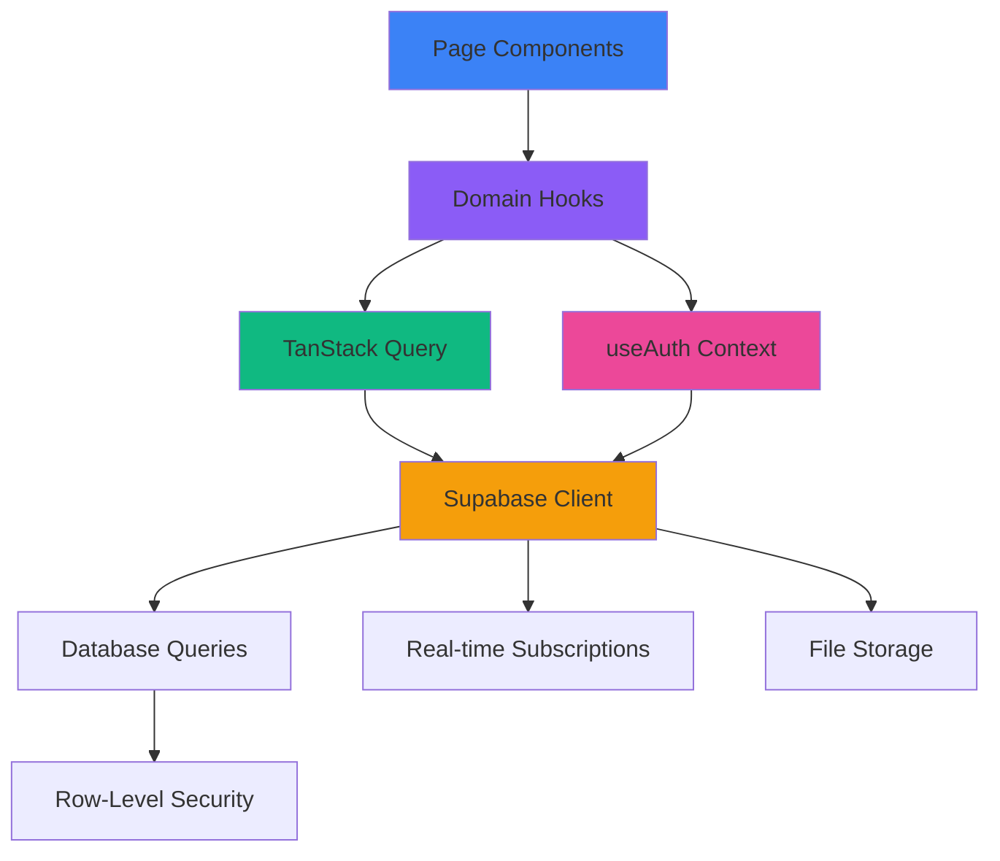
```mermaid
graph TD
    A[Page Components] --> B[Domain Hooks]
    B --> C[useAuth Context]
    B --> D[TanStack Query]
    
    D --> E[Supabase Client]
    C --> E
    
    E --> F[Database Queries]
    E --> G[Real-time Subscriptions]
    E --> H[File Storage]
    
    F --> I[Row-Level Security]
    
    style A fill:#3b82f6
    style B fill:#8b5cf6
    style C fill:#ec4899
    style D fill:#10b981
    style E fill:#f59e0b
```

### Hook Usage Example in Pages

```tsx
// Example: TeacherOverview.tsx
import { useAuth } from '@/contexts/AuthContext';
import { useTeacherCourses } from '@/hooks/useCourses';
import { useExams } from '@/hooks/useExams';
import { useAssignments } from '@/hooks/useAssignments';
import { usePendingGrading } from '@/hooks/usePendingGrading';

export default function TeacherOverview() {
  const { user } = useAuth();                           // Auth context
  const { courses, isLoading: coursesLoading } = useTeacherCourses(user?.id);
  const { exams } = useExams();
  const { assignments } = useAssignments();
  const { pendingItems } = usePendingGrading();
  
  // Render dashboard using fetched data
  return (
    <div>
      <StatsCards courses={courses} exams={exams} />
      <PendingGradingWidget items={pendingItems} />
    </div>
  );
}
```

---

## Context Providers

The app uses **3 main context providers** for global state management.

### AuthContext

**Purpose:** Manages user authentication, session, profile, and role.

**Location:** [AuthContext.tsx](https://github.com/lil-id/classroom-companion/blob/main/src/contexts/AuthContext.tsx)

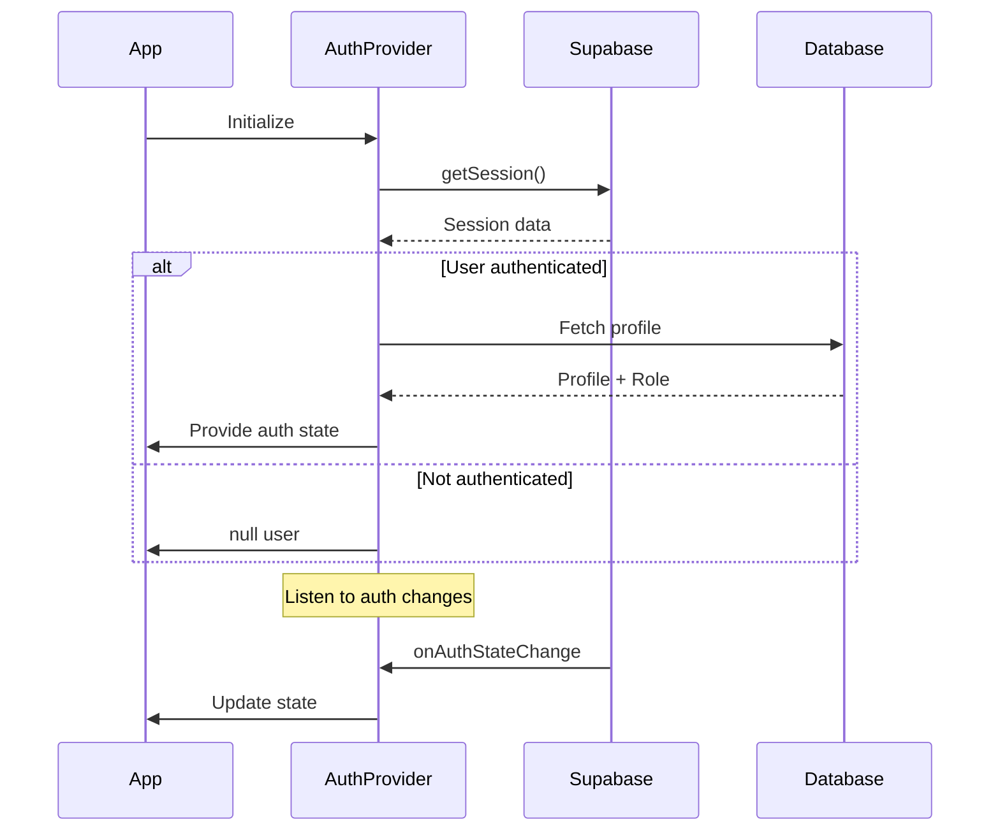
```mermaid
sequenceDiagram
    participant App
    participant AuthProvider
    participant Supabase
    participant Database
    
    App->>AuthProvider: Initialize
    AuthProvider->>Supabase: getSession()
    Supabase-->>AuthProvider: Session data
    
    alt User authenticated
        AuthProvider->>Database: Fetch profile
        Database-->>AuthProvider: Profile + Role
        AuthProvider->>App: Provide auth state
    else Not authenticated
        AuthProvider->>App: null user
    end
    
    Note over AuthProvider: Listen to auth changes
    Supabase->>AuthProvider: onAuthStateChange
    AuthProvider->>App: Update state
```

**State & Methods:**

```tsx
interface AuthContextType {
  user: User | null;                              // Supabase user object
  session: Session | null;                        // Active session
  profile: Profile | null;                        // User profile data
  role: 'teacher' | 'student' | null;            // User role
  signUp: (email, password, name, role) => Promise;
  signIn: (email, password) => Promise;
  signOut: () => Promise;
  updateLanguagePreference: (lang) => Promise;
  isLoading: boolean;                             // Initial load state
}
```

**Authentication Flow:**

```tsx
// 1. On app initialization
useEffect(() => {
  // Listen to auth state changes
  const { data: { subscription } } = supabase.auth.onAuthStateChange(
    (event, session) => {
      setSession(session);
      setUser(session?.user ?? null);
      
      if (session?.user) {
        fetchProfile(session.user.id);          // Fetch profile + role
      } else {
        setProfile(null);
        setRole(null);
      }
    }
  );
  
  // Check for existing session
  supabase.auth.getSession().then(({ data: { session } }) => {
    setSession(session);
    setUser(session?.user ?? null);
    if (session?.user) {
      fetchProfile(session.user.id);
    }
  });
  
  return () => subscription.unsubscribe();
}, []);

// 2. Fetch profile and role
const fetchProfile = async (userId: string) => {
  // Get profile
  const { data: profileData } = await supabase
    .from('profiles')
    .select('*')
    .eq('user_id', userId)
    .maybeSingle();
  
  setProfile(profileData);
  
  // Apply language preference
  if (profileData?.language_preference) {
    i18n.changeLanguage(profileData.language_preference);
  }
  
  // Get role
  const { data: roleData } = await supabase
    .from('user_roles')
    .select('role')
    .eq('user_id', userId)
    .maybeSingle();
  
  setRole(roleData?.role);
};
```

**Usage in Components:**

```tsx
import { useAuth } from '@/contexts/AuthContext';

function MyComponent() {
  const { user, role, signOut } = useAuth();
  
  if (!user) return <Login />;
  
  return (
    <div>
      <h1>Welcome, {user.email}</h1>
      <p>Role: {role}</p>
      <button onClick={signOut}>Logout</button>
    </div>
  );
}
```

### DemoContext

**Purpose:** Manages demo mode state and role switching.

**Location:** [DemoContext.tsx](https://github.com/lil-id/classroom-companion/blob/main/src/contexts/DemoContext.tsx)

```tsx
interface DemoContextType {
  isDemo: boolean;                                // Always true in demo
  demoRole: 'teacher' | 'student';               // Current demo role
  setDemoRole: (role) => void;                   // Switch demo role
  exitDemo: () => void;                          // Exit to homepage
}
```

**Demo Role Persistence:**

```tsx
// Role is determined from URL path
const getRoleFromPath = (pathname: string): 'teacher' | 'student' => {
  if (pathname.includes('/demo/student')) {
    return 'student';
  }
  return 'teacher';  // Default to teacher
};

// Sync role with URL
useEffect(() => {
  const roleFromPath = getRoleFromPath(location.pathname);
  if (roleFromPath !== demoRole) {
    setDemoRole(roleFromPath);
  }
}, [location.pathname]);
```

**Usage:**

```tsx
import { useDemoContext, useIsDemo } from '@/contexts/DemoContext';

function DemoComponent() {
  const { demoRole, setDemoRole, exitDemo } = useDemoContext();
  const isDemo = useIsDemo();  // Shorthand hook
  
  return (
    <div>
      {isDemo && <DemoBanner role={demoRole} onExit={exitDemo} />}
    </div>
  );
}
```

### SidebarContext

**Purpose:** Manages sidebar open/closed state for responsive layouts.

**Location:** [SidebarContext.tsx](https://github.com/lil-id/classroom-companion/blob/main/src/contexts/SidebarContext.tsx)

```tsx
interface SidebarContextType {
  isOpen: boolean;
  toggle: () => void;
  setOpen: (open: boolean) => void;
}
```

**Usage in Layouts:**

```tsx
// TeacherLayout wraps content with SidebarProvider
<SidebarProvider>
  <TeacherLayout />
</SidebarProvider>

// Inside layout, toggle sidebar
const { isOpen, toggle } = useSidebarContext();

<button onClick={toggle}>
  {isOpen ? <PanelLeftClose /> : <PanelLeft />}
</button>
```

---

## Routing & Navigation

The application uses **React Router v6** with nested routing and role-based protection.

### Route Structure

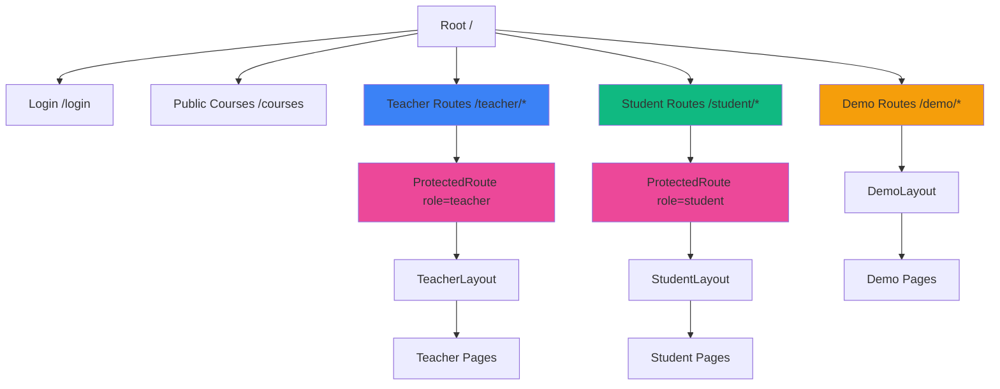
```mermaid
graph TD
    A["Root /"] --> B["Login /login"]
    A --> C["Public Courses /courses"]
    A --> D["Teacher Routes /teacher/*"]
    A --> E["Student Routes /student/*"]
    A --> F["Demo Routes /demo/*"]
    
    D --> G["ProtectedRoute role=teacher"]
    E --> H["ProtectedRoute role=student"]
    
    G --> I[TeacherLayout]
    H --> J[StudentLayout]
    F --> K[DemoLayout]
    
    I --> L[Teacher Pages]
    J --> M[Student Pages]
    K --> N[Demo Pages]
    
    style D fill:#3b82f6
    style E fill:#10b981
    style F fill:#f59e0b
    style G fill:#ec4899
    style H fill:#ec4899
```

### Protected Routes Implementation

```tsx
// App.tsx route configuration
<Route path="/teacher" element={
  <ProtectedRoute requiredRole="teacher">
    <SidebarProvider>
      <TeacherLayout />
    </SidebarProvider>
  </ProtectedRoute>
}>
  <Route index element={<TeacherOverview />} />
  <Route path="courses" element={<TeacherCourses />} />
  <Route path="courses/:courseId" element={<TeacherCourseDetail />} />
  <Route path="exams" element={<TeacherExams />} />
  {/* ... more routes */}
</Route>
```

**ProtectedRoute Logic:**

```tsx
// ProtectedRoute.tsx
export function ProtectedRoute({ children, requiredRole }: Props) {
  const { user, role, isLoading } = useAuth();
  const navigate = useNavigate();
  const location = useLocation();
  
  useEffect(() => {
    if (!isLoading) {
      if (!user) {
        // Redirect to login, preserve current path
        navigate('/login', { 
          state: { from: location.pathname }, 
          replace: true 
        });
      } else if (requiredRole && role && role !== requiredRole) {
        // Wrong role, redirect to correct dashboard
        navigate(role === 'teacher' ? '/teacher' : '/student', { 
          replace: true 
        });
      }
    }
  }, [user, role, isLoading, requiredRole]);
  
  // Show loading spinner while checking auth
  if (isLoading) {
    return <LoadingSpinner />;
  }
  
  // Not authenticated or wrong role
  if (!user || (requiredRole && role !== requiredRole)) {
    return null;
  }
  
  // Authenticated with correct role
  return <>{children}</>;
}
```

**Code Reference:** [ProtectedRoute.tsx](https://github.com/lil-id/classroom-companion/blob/main/src/components/ProtectedRoute.tsx#L22-L56)

### Navigation Hierarchy

```
Public Routes (No Auth Required)
├── / (Homepage)
├── /login
├── /forgot-password
├── /reset-password
└── /courses (Browse courses)

Teacher Routes (Protected: role='teacher')
└── /teacher
    ├── / (Overview/Dashboard)
    ├── /courses
    ├── /courses/:courseId
    ├── /courses/:courseId/attendance/:sessionId
    ├── /exams
    ├── /exams/new
    ├── /exams/:examId/edit
    ├── /exams/:examId/grade
    ├── /assignments
    ├── /assignments/new
    ├── /assignments/:assignmentId/submissions
    ├── /students
    ├── /materials
    ├── /analytics
    ├── /calendar
    ├── /at-risk
    ├── /report-cards
    ├── /attendance
    ├── /question-bank
    ├── /profile
    └── /settings

Student Routes (Protected: role='student')
└── /student
    ├── / (Dashboard)
    ├── /courses
    ├── /explore
    ├── /courses/:courseId
    ├── /exams
    ├── /exam/:examId
    ├── /exam/:examId/results
    ├── /assignments
    ├── /assignments/:assignmentId
    ├── /materials
    ├── /badges
    ├── /analytics
    ├── /calendar
    ├── /report-cards
    ├── /attendance
    ├── /notifications
    ├── /profile
    └── /settings

Demo Routes (No Auth Required)
└── /demo
    ├── /teacher/* (30 demo pages)
    └── /student/*
```

---

## State Management Patterns

The application uses a **hybrid state management** approach:

1. **Server State** - TanStack Query (React Query)
2. **Global Client State** - React Context
3. **Local Component State** - useState/useReducer

### State Management Architecture

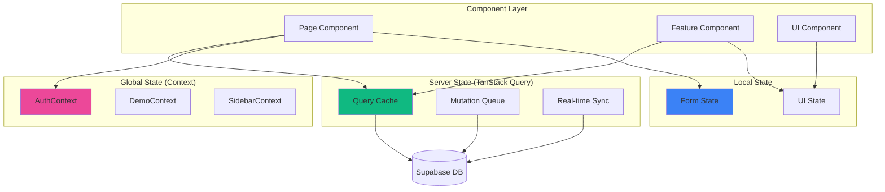
```mermaid
flowchart TB
    subgraph Component["Component Layer"]
        A[Page Component]
        B[Feature Component]
        C[UI Component]
    end
    
    subgraph ServerState["Server State (TanStack Query)"]
        D[Query Cache]
        E[Mutation Queue]
        F[Real-time Sync]
    end
    
    subgraph GlobalState["Global State (Context)"]
        G[AuthContext]
        H[DemoContext]
        I[SidebarContext]
    end
    
    subgraph LocalState["Local State"]
        J[Form State]
        K[UI State]
    end
    
    A --> D
    A --> G
    A --> J
    
    B --> D
    B --> K
    
    C --> K
    
    D --> L[(Supabase DB)]
    E --> L
    F --> L
    
    style D fill:#10b981
    style G fill:#ec4899
    style J fill:#3b82f6
```

### TanStack Query Patterns

**Cache Keys Strategy:**

```tsx
// Use descriptive, hierarchical cache keys
['courses']                          // All courses
['courses', courseId]                // Specific course
['exams']                            // All exams
['exams', courseId]                  // Exams for a course
['exam-submissions', examId]         // Submissions for an exam
```

**Data Fetching Pattern:**

```tsx
const { data, isLoading, error } = useQuery({
  queryKey: ['courses', courseId],
  queryFn: async () => {
    const { data, error } = await supabase
      .from('courses')
      .select('*')
      .eq('id', courseId)
      .single();
    
    if (error) throw error;
    return data;
  },
  enabled: !!courseId,               // Only run when courseId exists
  staleTime: 1000 * 60 * 5,          // Consider fresh for 5 minutes
});
```

**Mutation Pattern:**

```tsx
const mutation = useMutation({
  mutationFn: async (newCourse) => {
    const { data, error } = await supabase
      .from('courses')
      .insert([newCourse])
      .select()
      .single();
    
    if (error) throw error;
    return data;
  },
  onSuccess: (data) => {
    // Invalidate and refetch courses list
    queryClient.invalidateQueries({ queryKey: ['courses'] });
    
    // Show success toast
    toast.success('Course created successfully!');
  },
  onError: (error) => {
    toast.error(`Error: ${error.message}`);
  },
});

// Usage
mutation.mutate({ title: 'New Course', ... });
```

**Real-time Cache Invalidation:**

```tsx
// Pattern used in all hooks
useEffect(() => {
  if (!user) return;
  
  const channel = supabase
    .channel('table-changes')
    .on('postgres_changes', {
      event: '*',                    // INSERT, UPDATE, DELETE
      schema: 'public',
      table: 'courses',
    }, (payload) => {
      console.log('Change detected:', payload);
      
      // Invalidate cache to trigger refetch
      queryClient.invalidateQueries({ queryKey: ['courses'] });
    })
    .subscribe();
  
  return () => {
    supabase.removeChannel(channel);
  };
}, [user, queryClient]);
```

**Optimistic Updates:**

```tsx
// Example: Toggle course status optimistically
const toggleMutation = useMutation({
  mutationFn: async ({ courseId, newStatus }) => {
    const { error } = await supabase
      .from('courses')
      .update({ status: newStatus })
      .eq('id', courseId);
    
    if (error) throw error;
  },
  onMutate: async ({ courseId, newStatus }) => {
    // Cancel outgoing refetches
    await queryClient.cancelQueries({ queryKey: ['courses'] });
    
    // Snapshot current value
    const previous = queryClient.getQueryData(['courses']);
    
    // Optimistically update cache
    queryClient.setQueryData(['courses'], (old) => 
      old.map(course => 
        course.id === courseId 
          ? { ...course, status: newStatus }
          : course
      )
    );
    
    // Return context for rollback
    return { previous };
  },
  onError: (err, variables, context) => {
    // Rollback on error
    queryClient.setQueryData(['courses'], context.previous);
    toast.error('Failed to update course');
  },
  onSettled: () => {
    // Always refetch after mutation
    queryClient.invalidateQueries({ queryKey: ['courses'] });
  },
});
```

---

## Form Handling Architecture

Forms use **React Hook Form** + **Zod** for validation.

### Form Pattern

```tsx
// Example: Course creation form
import { useForm } from 'react-hook-form';
import { zodResolver } from '@hookform/resolvers/zod';
import * as z from 'zod';

// 1. Define Zod schema
const courseSchema = z.object({
  title: z.string().min(1, 'Title is required').max(100),
  description: z.string().min(10, 'Description must be at least 10 characters'),
  status: z.enum(['draft', 'published', 'archived']),
  start_date: z.string().optional(),
});

type CourseFormData = z.infer<typeof courseSchema>;

// 2. Initialize form
function CourseForm() {
  const form = useForm<CourseFormData>({
    resolver: zodResolver(courseSchema),
    defaultValues: {
      title: '',
      description: '',
      status: 'draft',
    },
  });
  
  // 3. Handle submission
  const onSubmit = async (data: CourseFormData) => {
    try {
      const { error } = await supabase
        .from('courses')
        .insert([{ ...data, teacher_id: user.id }]);
      
      if (error) throw error;
      
      toast.success('Course created!');
      queryClient.invalidateQueries({ queryKey: ['courses'] });
    } catch (error) {
      toast.error('Failed to create course');
    }
  };
  
  // 4. Render form with shadcn/ui components
  return (
    <Form {...form}>
      <form onSubmit={form.handleSubmit(onSubmit)}>
        <FormField
          control={form.control}
          name="title"
          render={({ field }) => (
            <FormItem>
              <FormLabel>Course Title</FormLabel>
              <FormControl>
                <Input {...field} placeholder="Enter title" />
              </FormControl>
              <FormMessage />
            </FormItem>
          )}
        />
        
        {/* More fields... */}
        
        <Button type="submit" disabled={form.formState.isSubmitting}>
          {form.formState.isSubmitting ? 'Creating...' : 'Create Course'}
        </Button>
      </form>
    </Form>
  );
}
```

**Form State Flow:**

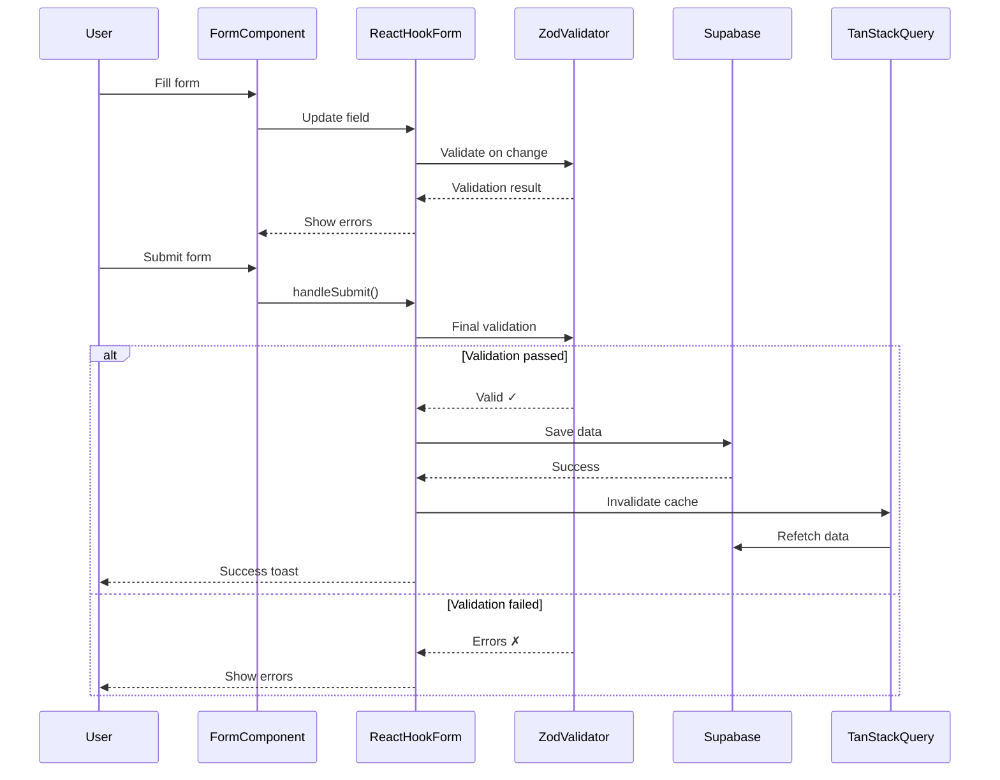
```mermaid
sequenceDiagram
    participant User
    participant FormComponent
    participant ReactHookForm
    participant ZodValidator
    participant Supabase
    participant TanStackQuery
    
    User->>FormComponent: Fill form
    FormComponent->>ReactHookForm: Update field
    ReactHookForm->>ZodValidator: Validate on change
    ZodValidator-->>ReactHookForm: Validation result
    ReactHookForm-->>FormComponent: Show errors
    
    User->>FormComponent: Submit form
    FormComponent->>ReactHookForm: handleSubmit()
    ReactHookForm->>ZodValidator: Final validation
    
    alt Validation passed
        ZodValidator-->>ReactHookForm: Valid ✓
        ReactHookForm->>Supabase: Save data
        Supabase-->>ReactHookForm: Success
        ReactHookForm->>TanStackQuery: Invalidate cache
        TanStackQuery->>Supabase: Refetch data
        ReactHookForm-->>User: Success toast
    else Validation failed
        ZodValidator-->>ReactHookForm: Errors ✗
        ReactHookForm-->>User: Show errors
    end
```

---

## Key User Flows

Let's examine code-level details for critical user flows.

### Flow 1: Teacher Creates an Exam

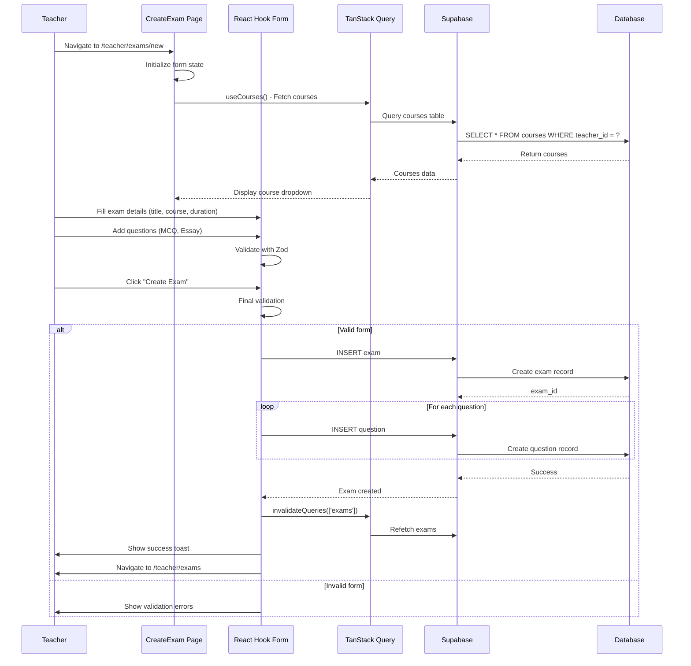
```mermaid
sequenceDiagram
    participant T as Teacher
    participant P as CreateExam Page
    participant F as React Hook Form
    participant Q as TanStack Query
    participant S as Supabase
    participant DB as Database
    
    T->>P: Navigate to /teacher/exams/new
    P->>P: Initialize form state
    P->>Q: useCourses() - Fetch courses
    Q->>S: Query courses table
    S->>DB: SELECT * FROM courses WHERE teacher_id = ?
    DB-->>S: Return courses
    S-->>Q: Courses data
    Q-->>P: Display course dropdown
    
    T->>F: Fill exam details (title, course, duration)
    T->>F: Add questions (MCQ, Essay)
    F->>F: Validate with Zod
    
    T->>F: Click "Create Exam"
    F->>F: Final validation
    
    alt Valid form
        F->>S: INSERT exam
        S->>DB: Create exam record
        DB-->>S: exam_id
        
        loop For each question
            F->>S: INSERT question
            S->>DB: Create question record
        end
        
        DB-->>S: Success
        S-->>F: Exam created
        F->>Q: invalidateQueries(['exams'])
        Q->>S: Refetch exams
        F->>T: Show success toast
        F->>T: Navigate to /teacher/exams
    else Invalid form
        F->>T: Show validation errors
    end
```

**Code Reference:**
- Page: [CreateExam.tsx](https://github.com/lil-id/classroom-companion/blob/main/src/pages/teacher/CreateExam.tsx)
- Hook: [useExams.ts](https://github.com/lil-id/classroom-companion/blob/main/src/hooks/useExams.ts)

### Flow 2: Student Enrolls in a Course

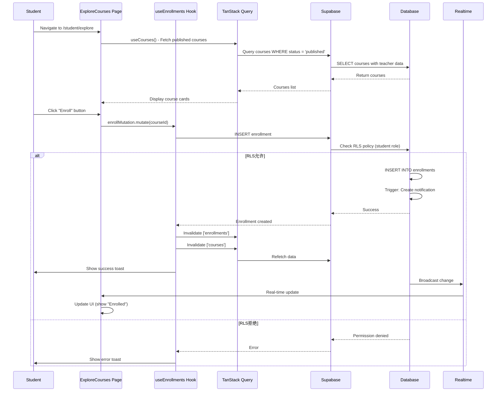
```mermaid
sequenceDiagram
    participant S as Student
    participant E as ExploreCourses Page
    participant H as useEnrollments Hook
    participant Q as TanStack Query
    participant SB as Supabase
    participant DB as Database
    participant RT as Realtime
    
    S->>E: Navigate to /student/explore
    E->>Q: useCourses() - Fetch published courses
    Q->>SB: Query courses WHERE status = 'published'
    SB->>DB: SELECT courses with teacher data
    DB-->>SB: Return courses
    SB-->>Q: Courses list
    Q-->>E: Display course cards
    
    S->>E: Click "Enroll" button
    E->>H: enrollMutation.mutate(courseId)
    H->>SB: INSERT enrollment
    SB->>DB: Check RLS policy (student role)
    
    alt RLS允许
        DB->>DB: INSERT INTO enrollments
        DB->>DB: Trigger: Create notification
        DB-->>SB: Success
        SB-->>H: Enrollment created
        H->>Q: Invalidate ['enrollments']
        H->>Q: Invalidate ['courses']
        Q->>SB: Refetch data
        H->>S: Show success toast
        
        DB->>RT: Broadcast change
        RT->>E: Real-time update
        E->>E: Update UI (show "Enrolled")
    else RLS拒绝
        DB-->>SB: Permission denied
        SB-->>H: Error
        H->>S: Show error toast
    end
```

**Key Components:**
- Page: [ExploreCourses.tsx](https://github.com/lil-id/classroom-companion/blob/main/src/pages/student/ExploreCourses.tsx)
- Hook: [useEnrollments.ts](https://github.com/lil-id/classroom-companion/blob/main/src/hooks/useEnrollments.ts)

### Flow 3: Real-time Notification

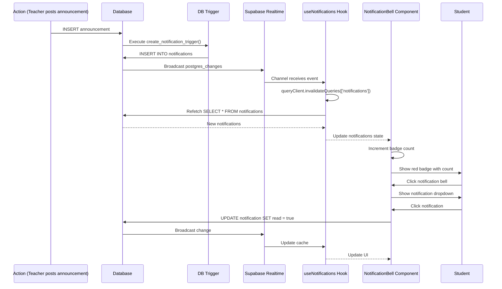
```mermaid
sequenceDiagram
    participant A as Action (Teacher posts announcement)
    participant DB as Database
    participant Trigger as DB Trigger
    participant Realtime as Supabase Realtime
    participant Hook as useNotifications Hook
    participant Bell as NotificationBell Component
    participant User as Student
    
    A->>DB: INSERT announcement
    DB->>Trigger: Execute create_notification_trigger()
    Trigger->>DB: INSERT INTO notifications
    
    DB->>Realtime: Broadcast postgres_changes
    Realtime->>Hook: Channel receives event
    Hook->>Hook: queryClient.invalidateQueries(['notifications'])
    Hook->>DB: Refetch SELECT * FROM notifications
    DB-->>Hook: New notifications
    Hook-->>Bell: Update notifications state
    Bell->>Bell: Increment badge count
    Bell->>User: Show red badge with count
    
    User->>Bell: Click notification bell
    Bell->>User: Show notification dropdown
    User->>Bell: Click notification
    Bell->>DB: UPDATE notification SET read = true
    DB->>Realtime: Broadcast change
    Realtime->>Hook: Update cache
    Hook-->>Bell: Update UI
```

**Code Reference:**
- Component: [NotificationBell.tsx](https://github.com/lil-id/classroom-companion/blob/main/src/components/NotificationBell.tsx)
- Hook: [useNotifications.ts](https://github.com/lil-id/classroom-companion/blob/main/src/hooks/useNotifications.ts)

### Flow 4: Authentication & Authorization

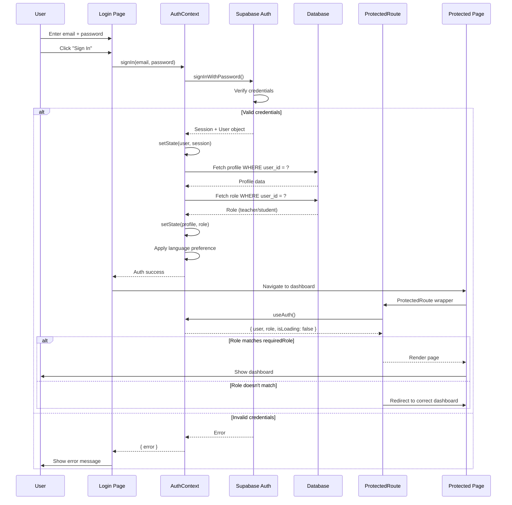
```mermaid
sequenceDiagram
    participant U as User
    participant L as Login Page
    participant AC as AuthContext
    participant SA as Supabase Auth
    participant DB as Database
    participant PR as ProtectedRoute
    participant Page as Protected Page
    
    U->>L: Enter email + password
    U->>L: Click "Sign In"
    L->>AC: signIn(email, password)
    AC->>SA: signInWithPassword()
    SA->>SA: Verify credentials
    
    alt Valid credentials
        SA-->>AC: Session + User object
        AC->>AC: setState(user, session)
        AC->>DB: Fetch profile WHERE user_id = ?
        DB-->>AC: Profile data
        AC->>DB: Fetch role WHERE user_id = ?
        DB-->>AC: Role (teacher/student)
        AC->>AC: setState(profile, role)
        AC->>AC: Apply language preference
        AC-->>L: Auth success
        
        L->>Page: Navigate to dashboard
        Page->>PR: ProtectedRoute wrapper
        PR->>AC: useAuth()
        AC-->>PR: { user, role, isLoading: false }
        
        alt Role matches requiredRole
            PR-->>Page: Render page
            Page->>U: Show dashboard
        else Role doesn't match
            PR->>Page: Redirect to correct dashboard
        end
    else Invalid credentials
        SA-->>AC: Error
        AC-->>L: { error }
        L->>U: Show error message
    end
```

**Code References:**
- Context: [AuthContext.tsx](https://github.com/lil-id/classroom-companion/blob/main/src/contexts/AuthContext.tsx#L92-L123)
- Component: [ProtectedRoute.tsx](https://github.com/lil-id/classroom-companion/blob/main/src/components/ProtectedRoute.tsx#L27-L37)

---

## Summary

This Phase 1 documentation covers the **frontend architecture** in detail:

✅ **Component Hierarchy** - Provider stack, layouts, shared components, 49 UI components  
✅ **Custom Hooks System** - 38 hooks following consistent TanStack Query patterns  
✅ **Context Providers** - AuthContext, DemoContext, SidebarContext with code examples  
✅ **Routing & Navigation** - Protected routes, role-based access, nested routing  
✅ **State Management** - TanStack Query for server state, Context for global state  
✅ **Form Handling** - React Hook Form + Zod validation patterns  
✅ **Key User Flows** - Code-level sequence diagrams for critical interactions  

---

## Backend Architecture & Database

This section covers **Phase 2**: Supabase integration, database schema, Row-Level Security (RLS) policies, and real-time subscriptions.

### Supabase Client Configuration

The application uses a single Supabase client instance configured in `src/integrations/supabase/client.ts`:

```typescript
import { createClient } from '@supabase/supabase-js';
import type { Database } from './types';

const SUPABASE_URL = import.meta.env.VITE_SUPABASE_URL;
const SUPABASE_PUBLISHABLE_KEY = import.meta.env.VITE_SUPABASE_PUBLISHABLE_KEY;

export const supabase = createClient<Database>(
  SUPABASE_URL, 
  SUPABASE_PUBLISHABLE_KEY, 
  {
    auth: {
      storage: localStorage,           // Persist auth in localStorage
      persistSession: true,             // Keep user logged in
      autoRefreshToken: true,           // Auto refresh expired tokens
    }
  }
);
```

**Configuration Details:**
- **Type Safety**: Uses auto-generated `Database` type from schema
- **Auth Storage**: localStorage for session persistence across refreshes
- **Auto Refresh**: Automatically refreshes tokens before expiration
- **Single Instance**: Imported across the entire app for consistency

**Code Reference:** [client.ts](https://github.com/lil-id/classroom-companion/blob/main/src/integrations/supabase/client.ts)

---

### Database Schema Overview

The database consists of **20+ tables** organized into logical domains. Here's the complete Entity Relationship Diagram:


```mermaid
erDiagram
    %% Authentication & Users
    auth_users ||--o{ profiles : "has"
    auth_users ||--o{ user_roles : "has"
    
    %% Courses & Enrollment
    auth_users ||--o{ courses : "teaches"
    courses ||--o{ enrollments : "has"
    auth_users ||--o{ enrollments : "enrolls_in"
    courses ||--o{ course_materials : "contains"
    
    %% Assessments
    courses ||--o{ exams : "has"
    courses ||--o{ assignments : "has"
    exams ||--o{ questions : "contains"
    assignments ||--o{ assignment_questions : "contains"
    
    %% Submissions
    exams ||--o{ exam_submissions : "receives"
    auth_users ||--o{ exam_submissions : "submits"
    assignments ||--o{ assignment_submissions : "receives"
    auth_users ||--o{ assignment_submissions : "submits"
    
    %% Question Bank
    auth_users ||--o{ question_bank : "creates"
    question_bank ||--o{ question_bank_tags : "has"
    
    %% Notifications & Communication
    courses ||--o{ announcements : "has"
    auth_users ||--o{ notifications : "receives"
    
    %% Achievements
    badges ||--o{ user_badges : "awarded_as"
    auth_users ||--o{ user_badges : "earns"
    
    %% Analytics
    courses ||--o{ progress_tracking : "tracks"
    auth_users ||--o{ progress_tracking : "tracked_for"
    courses ||--o{ at_risk_students : "identifies"
    auth_users ||--o{ at_risk_students : "flagged_as"
    
    %% Academic Structure
    academic_periods ||--o{ courses : "contains"
    academic_periods ||--o{ report_cards : "generates_for"
    auth_users ||--o{ report_cards : "receives"
    report_cards ||--o{ report_card_items : "contains"
    
    %% Attendance
    courses ||--o{ attendance_sessions : "has"
    attendance_sessions ||--o{ attendance_records : "records"
    auth_users ||--o{ attendance_records : "tracked_for"
    
    %% Calendar
    courses ||--o{ calendar_events : "schedules"
```

---

### Core Database Tables

#### User & Authentication Tables

**profiles**
```sql
CREATE TABLE public.profiles (
  id UUID PRIMARY KEY DEFAULT gen_random_uuid(),
  user_id UUID NOT NULL UNIQUE REFERENCES auth.users(id) ON DELETE CASCADE,
  email TEXT NOT NULL,
  name TEXT NOT NULL,
  avatar_url TEXT,
  bio TEXT,
  language_preference TEXT DEFAULT 'en',
  created_at TIMESTAMP WITH TIME ZONE NOT NULL DEFAULT now(),
  updated_at TIMESTAMP WITH TIME ZONE NOT NULL DEFAULT now()
);
```

**user_roles**
```sql
CREATE TYPE public.app_role AS ENUM ('teacher', 'student');

CREATE TABLE public.user_roles (
  id UUID PRIMARY KEY DEFAULT gen_random_uuid(),
  user_id UUID NOT NULL REFERENCES auth.users(id) ON DELETE CASCADE,
  role app_role NOT NULL,
  UNIQUE(user_id, role)
);
```

#### Course Tables

**courses**
```sql
CREATE TABLE public.courses (
  id UUID PRIMARY KEY DEFAULT gen_random_uuid(),
  title TEXT NOT NULL,
  description TEXT,
  teacher_id UUID NOT NULL REFERENCES auth.users(id) ON DELETE CASCADE,
  thumbnail_url TEXT,
  status TEXT NOT NULL DEFAULT 'draft' 
    CHECK (status IN ('draft', 'published', 'archived')),
  academic_period_id UUID REFERENCES public.academic_periods(id),
  created_at TIMESTAMP WITH TIME ZONE NOT NULL DEFAULT now(),
  updated_at TIMESTAMP WITH TIME ZONE NOT NULL DEFAULT now()
);
```

**enrollments**
```sql
CREATE TABLE public.enrollments (
  id UUID PRIMARY KEY DEFAULT gen_random_uuid(),
  student_id UUID NOT NULL REFERENCES auth.users(id) ON DELETE CASCADE,
  course_id UUID NOT NULL REFERENCES public.courses(id) ON DELETE CASCADE,
  enrolled_at TIMESTAMP WITH TIME ZONE NOT NULL DEFAULT now(),
  UNIQUE(student_id, course_id)  -- One enrollment per student per course
);
```

**course_materials**
```sql
CREATE TABLE public.course_materials (
  id UUID PRIMARY KEY DEFAULT gen_random_uuid(),
  course_id UUID NOT NULL REFERENCES public.courses(id) ON DELETE CASCADE,
  title TEXT NOT NULL,
  description TEXT,
  file_name TEXT,                  -- Nullable for video-only materials
  file_path TEXT,                  -- Path in storage bucket
  file_type TEXT,                  -- pdf, video, etc.
  file_size INTEGER,
  video_url TEXT,                  -- For YouTube/external videos
  created_at TIMESTAMP WITH TIME ZONE NOT NULL DEFAULT now(),
  updated_at TIMESTAMP WITH TIME ZONE NOT NULL DEFAULT now()
);
```

#### Assessment Tables

**exams**
```sql
CREATE TABLE public.exams (
  id UUID PRIMARY KEY DEFAULT gen_random_uuid(),
  course_id UUID NOT NULL REFERENCES public.courses(id) ON DELETE CASCADE,
  title TEXT NOT NULL,
  description TEXT,
  duration INTEGER NOT NULL DEFAULT 60,  -- Duration in minutes
  total_points INTEGER NOT NULL DEFAULT 0,
  status TEXT NOT NULL DEFAULT 'draft' 
    CHECK (status IN ('draft', 'published')),
  due_date TIMESTAMP WITH TIME ZONE,
  created_at TIMESTAMP WITH TIME ZONE NOT NULL DEFAULT now(),
  updated_at TIMESTAMP WITH TIME ZONE NOT NULL DEFAULT now()
);
```

**questions**
```sql
CREATE TABLE public.questions (
  id UUID PRIMARY KEY DEFAULT gen_random_uuid(),
  exam_id UUID NOT NULL REFERENCES public.exams(id) ON DELETE CASCADE,
  type TEXT NOT NULL CHECK (type IN ('multiple-choice', 'multiple-select', 'essay')),
  question TEXT NOT NULL,
  options JSONB,                        -- Array of options for MCQ
  correct_answer INTEGER,               -- For single MCQ
  correct_answers INTEGER[],            -- For multiple-select
  points INTEGER NOT NULL DEFAULT 10,
  order_index INTEGER NOT NULL DEFAULT 0,
  created_at TIMESTAMP WITH TIME ZONE NOT NULL DEFAULT now()
);
```

**exam_submissions**
```sql
CREATE TABLE public.exam_submissions (
  id UUID PRIMARY KEY DEFAULT gen_random_uuid(),
  exam_id UUID NOT NULL REFERENCES public.exams(id) ON DELETE CASCADE,
  student_id UUID NOT NULL REFERENCES auth.users(id) ON DELETE CASCADE,
  answers JSONB NOT NULL DEFAULT '{}',  -- { questionId: answer }
  score INTEGER,
  graded BOOLEAN NOT NULL DEFAULT false,
  submitted_at TIMESTAMP WITH TIME ZONE NOT NULL DEFAULT now(),
  UNIQUE(exam_id, student_id)          -- One submission per exam per student
);
```

**assignments**
```sql
CREATE TABLE public.assignments (
  id UUID PRIMARY KEY DEFAULT gen_random_uuid(),
  course_id UUID NOT NULL REFERENCES public.courses(id) ON DELETE CASCADE,
  title TEXT NOT NULL,
  description TEXT,
  instructions TEXT,
  due_date TIMESTAMP WITH TIME ZONE NOT NULL,
  max_points INTEGER NOT NULL DEFAULT 100,
  allow_late_submissions BOOLEAN NOT NULL DEFAULT false,
  late_penalty_percent INTEGER DEFAULT 10,
  rubric JSONB DEFAULT '[]'::jsonb,    -- Grading rubric
  status TEXT NOT NULL DEFAULT 'draft',
  created_at TIMESTAMP WITH TIME ZONE NOT NULL DEFAULT now(),
  updated_at TIMESTAMP WITH TIME ZONE NOT NULL DEFAULT now()
);
```

**assignment_submissions**
```sql
CREATE TABLE public.assignment_submissions (
  id UUID PRIMARY KEY DEFAULT gen_random_uuid(),
  assignment_id UUID NOT NULL REFERENCES public.assignments(id) ON DELETE CASCADE,
  student_id UUID NOT NULL,
  file_path TEXT,                      -- Path to uploaded file
  file_name TEXT,
  text_content TEXT,                   -- For text-based submissions
  submitted_at TIMESTAMP WITH TIME ZONE NOT NULL DEFAULT now(),
  is_late BOOLEAN NOT NULL DEFAULT false,
  score INTEGER,
  graded BOOLEAN NOT NULL DEFAULT false,
  feedback TEXT,
  rubric_scores JSONB DEFAULT '[]'::jsonb,
  UNIQUE(assignment_id, student_id)
);
```

---

### Row-Level Security (RLS) Policies

Supabase RLS provides **database-level authorization**. Every query is automatically filtered based on the authenticated user.

#### Helper Functions

Three critical helper functions are used across all policies:

```sql
-- Check if user has a specific role
CREATE OR REPLACE FUNCTION public.has_role(_user_id UUID, _role app_role)
RETURNS BOOLEAN AS $$
  SELECT EXISTS (
    SELECT 1 FROM public.user_roles
    WHERE user_id = _user_id AND role = _role
  )
$$ LANGUAGE sql STABLE SECURITY DEFINER;

-- Check if user is enrolled in a course
CREATE OR REPLACE FUNCTION public.is_enrolled(_user_id UUID, _course_id UUID)
RETURNS BOOLEAN AS $$
  SELECT EXISTS (
    SELECT 1 FROM public.enrollments
    WHERE student_id = _user_id AND course_id = _course_id
  )
$$ LANGUAGE sql STABLE SECURITY DEFINER;

-- Check if user owns/teaches a course
CREATE OR REPLACE FUNCTION public.owns_course(_user_id UUID, _course_id UUID)
RETURNS BOOLEAN AS $$
  SELECT EXISTS (
    SELECT 1 FROM public.courses
    WHERE id = _course_id AND teacher_id = _user_id
  )
$$ LANGUAGE sql STABLE SECURITY DEFINER;
```

#### Course Policies

```sql
-- Anyone can view published courses, teachers can view their drafts
CREATE POLICY "Anyone can view published courses" ON public.courses 
FOR SELECT USING (
  status = 'published' OR teacher_id = auth.uid()
);

-- Only teachers can create courses
CREATE POLICY "Teachers can insert courses" ON public.courses 
FOR INSERT WITH CHECK (
  public.has_role(auth.uid(), 'teacher') AND teacher_id = auth.uid()
);

-- Teachers can update their own courses
CREATE POLICY "Teachers can update own courses" ON public.courses 
FOR UPDATE USING (teacher_id = auth.uid());

-- Teachers can delete their own courses
CREATE POLICY "Teachers can delete own courses" ON public.courses 
FOR DELETE USING (teacher_id = auth.uid());
```

#### Exam Policies

```sql
-- Students can view published exams for enrolled courses
-- Teachers can view all exams for their courses
CREATE POLICY "View exams for enrolled or owned courses" ON public.exams 
FOR SELECT USING (
  public.owns_course(auth.uid(), course_id) OR 
  (status = 'published' AND public.is_enrolled(auth.uid(), course_id))
);

-- Only course owners (teachers) can create exams
CREATE POLICY "Teachers can insert exams" ON public.exams 
FOR INSERT WITH CHECK (
  public.owns_course(auth.uid(), course_id)
);

-- Only course owners can update/delete exams
CREATE POLICY "Teachers can update own exams" ON public.exams 
FOR UPDATE USING (public.owns_course(auth.uid(), course_id));

CREATE POLICY "Teachers can delete own exams" ON public.exams 
FOR DELETE USING (public.owns_course(auth.uid(), course_id));
```

#### Submission Policies

```sql
-- Students can view their own submissions
-- Teachers can view submissions for their courses
CREATE POLICY "View own submissions or teacher view" ON public.exam_submissions 
FOR SELECT USING (
  student_id = auth.uid() OR 
  EXISTS (
    SELECT 1 FROM public.exams e 
    WHERE e.id = exam_id AND public.owns_course(auth.uid(), e.course_id)
  )
);

-- Students can submit if enrolled
CREATE POLICY "Students can submit exams" ON public.exam_submissions 
FOR INSERT WITH CHECK (
  student_id = auth.uid() AND 
  public.is_enrolled(
    auth.uid(), 
    (SELECT course_id FROM public.exams WHERE id = exam_id)
  )
);

-- Teachers can grade submissions for their courses
CREATE POLICY "Teachers can grade submissions" ON public.exam_submissions 
FOR UPDATE USING (
  EXISTS (
    SELECT 1 FROM public.exams e 
    WHERE e.id = exam_id AND public.owns_course(auth.uid(), e.course_id)
  )
);
```

**Security Benefits:**
- ✅ **Database-level enforcement** - No way to bypass from frontend
- ✅ **Automatic filtering** - Queries automatically scoped to authorized data
- ✅ **Performance** - Policies run at database level, very efficient
- ✅ **Composable** - Helper functions reused across policies

**Code Reference:** [Initial migration](https://github.com/lil-id/classroom-companion/blob/main/supabase/migrations/20251227072342_0d8140ef-74dc-4ed7-a21f-6bf522997aae.sql)

---

### Storage Buckets & Policies

The application uses **Supabase Storage** for file uploads with 3 buckets:

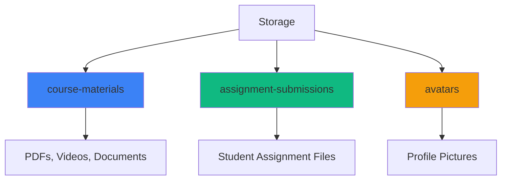
```mermaid
graph TD
    A[Storage] --> B[course-materials]
    A --> C[assignment-submissions]
    A --> D[avatars]
    
    B --> E[PDFs, Videos, Documents]
    C --> F[Student Assignment Files]
    D --> G[Profile Pictures]
    
    style B fill:#3b82f6
    style C fill:#10b981
    style D fill:#f59e0b
```

#### course-materials Bucket

**Configuration:**
- **Public**: `false` (private bucket)
- **Purpose**: Store course learning materials

**Policies:**

```sql
-- Teachers can upload materials for their courses
CREATE POLICY "Teachers can upload course materials" ON storage.objects
FOR INSERT WITH CHECK (
  bucket_id = 'course-materials' AND 
  auth.role() = 'authenticated'
);

-- Students and teachers can view materials for enrolled/owned courses
CREATE POLICY "Enrolled users can view course materials" ON storage.objects
FOR SELECT USING (
  bucket_id = 'course-materials' AND
  auth.uid() IS NOT NULL AND (
    -- Teacher owns course containing this material
    EXISTS (
      SELECT 1 FROM public.course_materials cm
      JOIN public.courses c ON c.id = cm.course_id
      WHERE cm.file_path = name AND c.teacher_id = auth.uid()
    ) OR
    -- Student enrolled in course containing this material
    EXISTS (
      SELECT 1 FROM public.course_materials cm
      JOIN public.enrollments e ON e.course_id = cm.course_id
      WHERE cm.file_path = name AND e.student_id = auth.uid()
    )
  )
);
```

#### assignment-submissions Bucket

**Configuration:**
- **Public**: `false`
- **Purpose**: Store student assignment file uploads

**Folder Structure:** `{student_id}/{assignment_id}/{filename}`

**Policies:**

```sql
-- Students can upload to their own folder
CREATE POLICY "Students can upload their submissions" ON storage.objects
FOR INSERT WITH CHECK (
  bucket_id = 'assignment-submissions' AND 
  auth.uid()::text = (storage.foldername(name))[1]  -- First folder = user ID
);

-- Students can view their own submissions
CREATE POLICY "Students can view their own submissions" ON storage.objects
FOR SELECT USING (
  bucket_id = 'assignment-submissions' AND 
  auth.uid()::text = (storage.foldername(name))[1]
);

-- Teachers can view submissions for their courses
CREATE POLICY "Teachers can view submissions for their courses" ON storage.objects
FOR SELECT USING (
  bucket_id = 'assignment-submissions' AND
  EXISTS (
    SELECT 1 FROM assignment_submissions s
    JOIN assignments a ON a.id = s.assignment_id
    WHERE s.file_path = name AND owns_course(auth.uid(), a.course_id)
  )
);
```

**Upload Flow:**

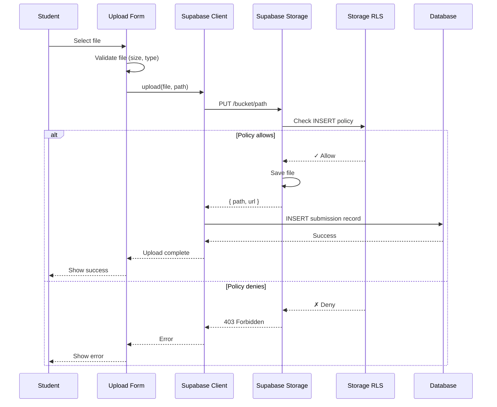
```mermaid
sequenceDiagram
    participant S as Student
    participant UI as Upload Form
    participant Client as Supabase Client
    participant Storage as Supabase Storage
    participant RLS as Storage RLS
    participant DB as Database
    
    S->>UI: Select file
    UI->>UI: Validate file (size, type)
    UI->>Client: upload(file, path)
    Client->>Storage: PUT /bucket/path
    Storage->>RLS: Check INSERT policy
    
    alt Policy allows
        RLS-->>Storage: ✓ Allow
        Storage->>Storage: Save file
        Storage-->>Client: { path, url }
        Client->>DB: INSERT submission record
        DB-->>Client: Success
        Client-->>UI: Upload complete
        UI-->>S: Show success
    else Policy denies
        RLS-->>Storage: ✗ Deny
        Storage-->>Client: 403 Forbidden
        Client-->>UI: Error
        UI-->>S: Show error
    end
```

---

### Database Triggers & Functions

The database uses triggers for automated tasks:

#### Auto-create User Profile

When a new user signs up via Supabase Auth, automatically create profile and role:

```sql
CREATE OR REPLACE FUNCTION public.handle_new_user()
RETURNS TRIGGER AS $$
BEGIN
  -- Create profile
  INSERT INTO public.profiles (user_id, email, name)
  VALUES (
    NEW.id,
    NEW.email,
    COALESCE(NEW.raw_user_meta_data->>'name', split_part(NEW.email, '@', 1))
  );
  
  -- Create role from signup metadata
  INSERT INTO public.user_roles (user_id, role)
  VALUES (
    NEW.id,
    (NEW.raw_user_meta_data->>'role')::app_role
  );
  
  RETURN NEW;
END;
$$ LANGUAGE plpgsql SECURITY DEFINER;

-- Trigger on auth.users INSERT
CREATE TRIGGER on_auth_user_created
  AFTER INSERT ON auth.users
  FOR EACH ROW
  EXECUTE FUNCTION public.handle_new_user();
```

**Flow:**
1. User signs up with email, password, name, role
2. Supabase Auth creates `auth.users` entry
3. Trigger fires → creates `profiles` and `user_roles` entries
4. User is ready to use the app

#### Auto-update Timestamps

```sql
CREATE OR REPLACE FUNCTION public.update_updated_at_column()
RETURNS TRIGGER AS $$
BEGIN
  NEW.updated_at = now();
  RETURN NEW;
END;
$$ LANGUAGE plpgsql;

-- Apply to all tables with updated_at
CREATE TRIGGER update_profiles_updated_at 
  BEFORE UPDATE ON public.profiles 
  FOR EACH ROW EXECUTE FUNCTION public.update_updated_at_column();

CREATE TRIGGER update_courses_updated_at 
  BEFORE UPDATE ON public.courses 
  FOR EACH ROW EXECUTE FUNCTION public.update_updated_at_column();

-- ... (applied to ~15 tables)
```

#### Create Notification on Announcement

```sql
CREATE OR REPLACE FUNCTION public.create_announcement_notifications()
RETURNS TRIGGER AS $$
BEGIN
  -- Create notification for all enrolled students
  INSERT INTO public.notifications (user_id, title, message, type, related_id)
  SELECT 
    e.student_id,
    'New Announcement',
    NEW.title,
    'announcement',
    NEW.id
  FROM public.enrollments e
  WHERE e.course_id = NEW.course_id;
  
  RETURN NEW;
END;
$$ LANGUAGE plpgsql SECURITY DEFINER;

CREATE TRIGGER on_announcement_created
  AFTER INSERT ON public.announcements
  FOR EACH ROW
  EXECUTE FUNCTION public.create_announcement_notifications();
```

---

### Real-time Subscriptions

Supabase Realtime enables **live data synchronization** without polling.

#### Enabling Realtime on Tables

```sql
-- Enable realtime publications
ALTER PUBLICATION supabase_realtime ADD TABLE public.courses;
ALTER PUBLICATION supabase_realtime ADD TABLE public.exams;
ALTER PUBLICATION supabase_realtime ADD TABLE public.enrollments;
ALTER PUBLICATION supabase_realtime ADD TABLE public.exam_submissions;
ALTER PUBLICATION supabase_realtime ADD TABLE public.notifications;
```

#### Realtime Subscription Pattern

All data-fetching hooks use this pattern:

```typescript
// Pattern used in useCourses, useExams, useNotifications, etc.
useEffect(() => {
  if (!user) return;
  
  const channel = supabase
    .channel('table-name-changes')
    .on('postgres_changes', {
      event: '*',                    // INSERT, UPDATE, DELETE
      schema: 'public',
      table: 'table_name',
    }, (payload) => {
      console.log('Change detected:', payload);
      
      // Invalidate TanStack Query cache to trigger refetch
      queryClient.invalidateQueries({ queryKey: ['cache-key'] });
    })
    .subscribe();
  
  return () => {
    supabase.removeChannel(channel);
  };
}, [user, queryClient]);
```

#### Real-time Notification Flow

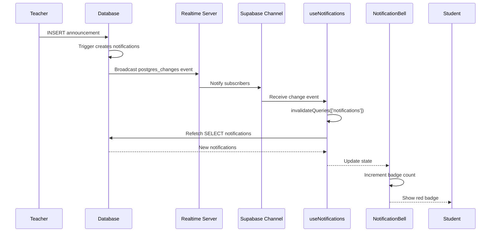
```mermaid
sequenceDiagram
    participant T as Teacher
    participant DB as Database
    participant RT as Realtime Server
    participant CH as Supabase Channel
    participant Hook as useNotifications
    participant Bell as NotificationBell
    participant S as Student
    
    T->>DB: INSERT announcement
    DB->>DB: Trigger creates notifications
    DB->>RT: Broadcast postgres_changes event
    RT->>CH: Notify subscribers
    CH->>Hook: Receive change event
    Hook->>Hook: invalidateQueries(['notifications'])
    Hook->>DB: Refetch SELECT notifications
    DB-->>Hook: New notifications
    Hook-->>Bell: Update state
    Bell->>Bell: Increment badge count
    Bell-->>S: Show red badge
```

**Benefits:**
- ✅ **Instant updates** - Changes appear in <100ms
- ✅ **No polling** - Efficient, real-time push updates
- ✅ **Automatic** - Hooks handle subscriptions automatically
- ✅ **Scalable** - Supabase manages WebSocket connections

---

### Data Flow: Complete Request Cycle

Let's trace a complete request from UI to database and back:

#### Example: Student Enrolls in Course

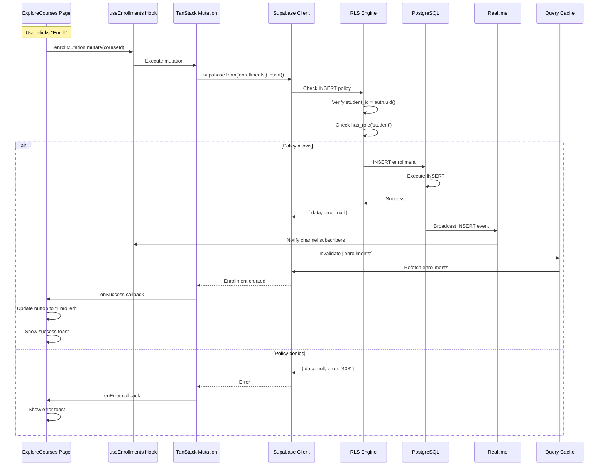
```mermaid
sequenceDiagram
    participant UI as ExploreCourses Page
    participant Hook as useEnrollments Hook
    participant Mutation as TanStack Mutation
    participant Client as Supabase Client
    participant RLS as RLS Engine
    participant DB as PostgreSQL
    participant Realtime as Realtime
    participant Cache as Query Cache
    
    Note over UI: User clicks "Enroll"
    
    UI->>Hook: enrollMutation.mutate(courseId)
    Hook->>Mutation: Execute mutation
    Mutation->>Client: supabase.from('enrollments').insert()
    Client->>RLS: Check INSERT policy
    
    RLS->>RLS: Verify student_id = auth.uid()
    RLS->>RLS: Check has_role('student')
    
    alt Policy allows
        RLS->>DB: INSERT enrollment
        DB->>DB: Execute INSERT
        DB-->>RLS: Success
        RLS-->>Client: { data, error: null }
        
        DB->>Realtime: Broadcast INSERT event
        Realtime->>Hook: Notify channel subscribers
        Hook->>Cache: Invalidate ['enrollments']
        Cache->>Client: Refetch enrollments
        
        Client-->>Mutation: Enrollment created
        Mutation->>UI: onSuccess callback
        UI->>UI: Update button to "Enrolled"
        UI->>UI: Show success toast
    else Policy denies
        RLS-->>Client: { data: null, error: '403' }
        Client-->>Mutation: Error
        Mutation->>UI: onError callback
        UI->>UI: Show error toast
    end
```

**Timeline:**
1. **0ms** - User interaction
2. **5-10ms** - Mutation initiated
3. **20-50ms** - Network request to Supabase
4. **10-20ms** - RLS policy check
5. **5-10ms** - Database INSERT
6. **10-20ms** - Response sent back
7. **50-100ms** - Total round trip
8. **+50ms** - Realtime broadcast to other clients
9. **+100ms** - Cache invalidation & refetch

---

## Summary (Phase 1 + 2)

This document now covers **frontend AND backend** architecture:

### Phase 1: Frontend Architecture ✅
- Component hierarchy with 65+ components
- 38 custom hooks with TanStack Query
- 3 context providers for global state
- Protected routing with role-based access
- State management patterns
- Form handling with React Hook Form + Zod

### Phase 2: Backend Architecture ✅
- Supabase client configuration
- Database schema with 20+ tables & ERD
- Row-Level Security (RLS) policies
- Helper functions for authorization
- Storage buckets with file upload policies
- Database triggers for automation
- Real-time subscription architecture
- Complete request/response cycles

---

## Developer Guide

This section covers **Phase 3**: common development workflows, troubleshooting, database migrations, and best practices for contributing to the AjarinAja project.

### Development Setup

#### Prerequisites

```bash
# Required software
- Node.js >= 18.0.0
- npm >= 9.0.0
- Git
- Supabase CLI (optional, for local development)
```

#### Initial Setup

```bash
# 1. Clone the repository
git clone https://github.com/lil-id/classroom-companion.git
cd classroom-companion

# 2. Install dependencies
npm install

# 3. Set up environment variables
cp .env.example .env.local

# 4. Configure Supabase credentials in .env.local
VITE_SUPABASE_PROJECT_ID=your_project_id
VITE_SUPABASE_URL=https://your-project.supabase.co
VITE_SUPABASE_PUBLISHABLE_KEY=your_publishable_key

# 5. Start development server
npm run dev
```

**Development Server:**
- URL: `http://localhost:5173`
- Hot reload enabled
- TypeScript type checking in real-time

---

### Common Development Workflows

#### Workflow 1: Adding a New Feature Page

**Scenario:** Adding a new "Course Analytics" page for teachers

**Steps:**

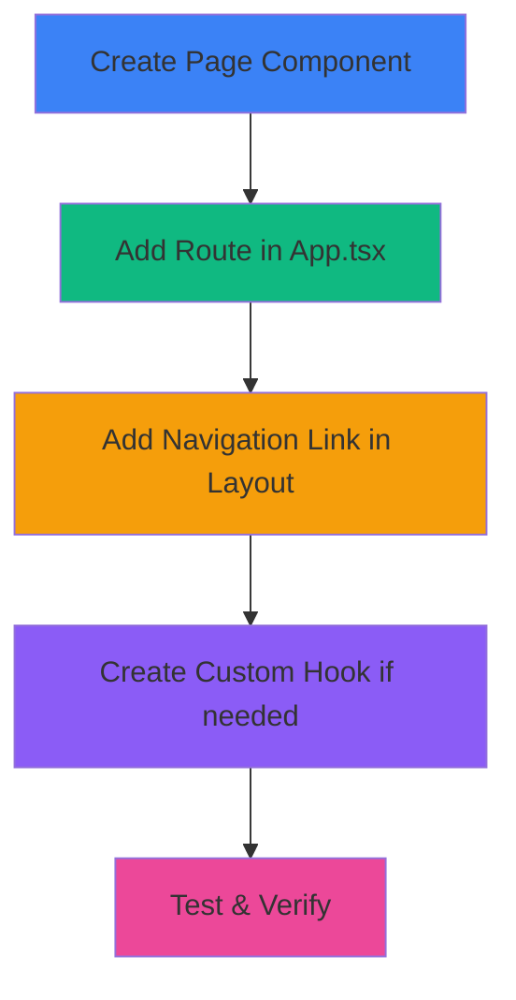
```mermaid
graph TD
    A[Create Page Component] --> B[Add Route in App.tsx]
    B --> C[Add Navigation Link in Layout]
    C --> D[Create Custom Hook if needed]
    D --> E[Test & Verify]
    
    style A fill:#3b82f6
    style B fill:#10b981
    style C fill:#f59e0b
    style D fill:#8b5cf6
    style E fill:#ec4899
```

**1. Create the Page Component**

```tsx
// src/pages/teacher/CourseAnalytics.tsx
import { useParams } from 'react-router-dom';
import { useCourseMetrics } from '@/hooks/useCourseMetrics';

export default function CourseAnalytics() {
  const { courseId } = useParams();
  const { metrics, isLoading } = useCourseMetrics(courseId);
  
  if (isLoading) return <div>Loading...</div>;
  
  return (
    <div className="p-6">
      <h1 className="text-2xl font-bold">Course Analytics</h1>
      {/* Your UI here */}
    </div>
  );
}
```

**2. Add Route in App.tsx**

```tsx
// src/App.tsx
import CourseAnalytics from '@/pages/teacher/CourseAnalytics';

// Inside teacher routes:
<Route 
  path="courses/:courseId/analytics" 
  element={<CourseAnalytics />} 
/>
```

**3. Add Navigation Link**

```tsx
// src/layouts/TeacherLayout.tsx
const navItems = [
  // ... existing items
  {
    icon: BarChart3,
    label: 'Analytics',
    href: `/teacher/courses/${courseId}/analytics`,
  },
];
```

**4. Create Custom Hook (if needed)**

```tsx
// src/hooks/useCourseMetrics.ts
import { useQuery } from '@tanstack/react-query';
import { supabase } from '@/integrations/supabase/client';

export function useCourseMetrics(courseId?: string) {
  return useQuery({
    queryKey: ['course-metrics', courseId],
    queryFn: async () => {
      const { data, error } = await supabase
        .from('course_metrics')
        .select('*')
        .eq('course_id', courseId)
        .single();
      
      if (error) throw error;
      return data;
    },
    enabled: !!courseId,
  });
}
```

---

#### Workflow 2: Adding a Database Table

**Scenario:** Adding a new `course_ratings` table

**Steps:**

**1. Create Migration File**

```bash
# Using Supabase CLI
cd supabase
supabase migration new add_course_ratings

# Or manually create file
touch supabase/migrations/YYYYMMDDHHMMSS_add_course_ratings.sql
```

**2. Write Migration SQL**

```sql
-- supabase/migrations/20260204000000_add_course_ratings.sql

-- Create table
CREATE TABLE public.course_ratings (
  id UUID PRIMARY KEY DEFAULT gen_random_uuid(),
  course_id UUID NOT NULL REFERENCES public.courses(id) ON DELETE CASCADE,
  student_id UUID NOT NULL REFERENCES auth.users(id) ON DELETE CASCADE,
  rating INTEGER NOT NULL CHECK (rating >= 1 AND rating <= 5),
  comment TEXT,
  created_at TIMESTAMP WITH TIME ZONE NOT NULL DEFAULT now(),
  UNIQUE(course_id, student_id)  -- One rating per student per course
);

-- Enable RLS
ALTER TABLE public.course_ratings ENABLE ROW LEVEL SECURITY;

-- Students can insert their own ratings
CREATE POLICY "Students can rate enrolled courses"
ON public.course_ratings FOR INSERT
WITH CHECK (
  student_id = auth.uid() AND
  is_enrolled(auth.uid(), course_id)
);

-- Students can view ratings for enrolled courses
CREATE POLICY "View ratings for enrolled courses"
ON public.course_ratings FOR SELECT
USING (
  is_enrolled(auth.uid(), course_id) OR
  owns_course(auth.uid(), course_id)
);

-- Students can update their own ratings
CREATE POLICY "Students can update own ratings"
ON public.course_ratings FOR UPDATE
USING (student_id = auth.uid());

-- Enable realtime
ALTER PUBLICATION supabase_realtime ADD TABLE public.course_ratings;
```

**3. Apply Migration**

```bash
# Local development
supabase db reset

# Production (via Supabase Dashboard or CLI)
supabase db push
```

**4. Generate TypeScript Types**

```bash
# Update types from database schema
npm run generate-types
# or manually
supabase gen types typescript --project-id your-project-id > src/integrations/supabase/types.ts
```

**5. Create Hook for New Table**

```tsx
// src/hooks/useCourseRatings.ts
import { useQuery, useMutation, useQueryClient } from '@tanstack/react-query';
import { supabase } from '@/integrations/supabase/client';
import { useAuth } from '@/contexts/AuthContext';

export function useCourseRatings(courseId?: string) {
  const { user } = useAuth();
  const queryClient = useQueryClient();
  
  const { data: ratings = [], isLoading } = useQuery({
    queryKey: ['course-ratings', courseId],
    queryFn: async () => {
      const { data, error } = await supabase
        .from('course_ratings')
        .select('*, student:profiles(name, avatar_url)')
        .eq('course_id', courseId)
        .order('created_at', { ascending: false });
      
      if (error) throw error;
      return data;
    },
    enabled: !!courseId && !!user,
  });
  
  const rateMutation = useMutation({
    mutationFn: async ({ rating, comment }: { rating: number; comment?: string }) => {
      const { data, error } = await supabase
        .from('course_ratings')
        .insert({
          course_id: courseId,
          student_id: user?.id,
          rating,
          comment,
        })
        .select()
        .single();
      
      if (error) throw error;
      return data;
    },
    onSuccess: () => {
      queryClient.invalidateQueries({ queryKey: ['course-ratings', courseId] });
    },
  });
  
  return { ratings, isLoading, rateMutation };
}
```

---

#### Workflow 3: Adding Real-time Notifications

**Scenario:** Notify students when teacher grades their assignment

**Steps:**

**1. Create Notification Trigger**

```sql
-- In migration file
CREATE OR REPLACE FUNCTION notify_student_on_grade()
RETURNS TRIGGER AS $$
BEGIN
  -- Only notify when graded changes from false to true
  IF NEW.graded = true AND OLD.graded = false THEN
    INSERT INTO public.notifications (
      user_id,
      title,
      message,
      type,
      related_id
    )
    VALUES (
      NEW.student_id,
      'Assignment Graded',
      'Your assignment has been graded',
      'grade',
      NEW.id
    );
  END IF;
  
  RETURN NEW;
END;
$$ LANGUAGE plpgsql SECURITY DEFINER;

CREATE TRIGGER on_assignment_graded
  AFTER UPDATE ON public.assignment_submissions
  FOR EACH ROW
  EXECUTE FUNCTION notify_student_on_grade();
```

**2. Hook Already Handles It**

The existing `useNotifications` hook already:
- Fetches notifications via `useQuery`
- Subscribes to real-time changes
- Invalidates cache on new notifications

**3. UI Component Shows Notification**

`NotificationBell.tsx` already renders notifications with badge count!

---

#### Workflow 4: Form with Validation

**Scenario:** Create exam form with question builder

**Steps:**

**1. Define Zod Schema**

```tsx
// src/lib/validations/exam.ts
import { z } from 'zod';

export const examSchema = z.object({
  title: z.string().min(3, 'Title must be at least 3 characters'),
  description: z.string().optional(),
  duration: z.number().min(1).max(480), // 1-480 minutes
  due_date: z.date(),
  questions: z.array(
    z.object({
      type: z.enum(['multiple-choice', 'essay']),
      question: z.string().min(5),
      options: z.array(z.string()).optional(),
      correct_answer: z.number().optional(),
      points: z.number().min(1),
    })
  ).min(1, 'At least one question required'),
});

export type ExamFormData = z.infer<typeof examSchema>;
```

**2. Create Form Component**

```tsx
// src/pages/teacher/CreateExam.tsx
import { useForm } from 'react-hook-form';
import { zodResolver } from '@hookform/resolvers/zod';
import { examSchema, ExamFormData } from '@/lib/validations/exam';
import { Form, FormField, FormItem, FormLabel, FormControl, FormMessage } from '@/components/ui/form';

export default function CreateExam() {
  const form = useForm<ExamFormData>({
    resolver: zodResolver(examSchema),
    defaultValues: {
      title: '',
      duration: 60,
      questions: [],
    },
  });
  
  const onSubmit = async (data: ExamFormData) => {
    // Handle submission
    console.log(data);
  };
  
  return (
    <Form {...form}>
      <form onSubmit={form.handleSubmit(onSubmit)}>
        <FormField
          control={form.control}
          name="title"
          render={({ field }) => (
            <FormItem>
              <FormLabel>Exam Title</FormLabel>
              <FormControl>
                <Input {...field} />
              </FormControl>
              <FormMessage />
            </FormItem>
          )}
        />
        {/* More fields... */}
        <Button type="submit">Create Exam</Button>
      </form>
    </Form>
  );
}
```

---

### Troubleshooting Guide

#### Common Issues & Solutions

**Issue 1: "Module not found" Error**

```
Error: Cannot find module '@/components/ui/button'
```

**Solution:**
```bash
# Check if path alias is configured in tsconfig.json
{
  "compilerOptions": {
    "paths": {
      "@/*": ["./src/*"]
    }
  }
}

# Check if file exists
ls src/components/ui/button.tsx

# If missing, install shadcn component
npx shadcn-ui@latest add button
```

---

**Issue 2: RLS Policy Blocking Query**

```
Error: 403 Forbidden - new row violates row-level security policy
```

**Solution:**

1. **Check policy exists:**
```sql
SELECT * FROM pg_policies 
WHERE tablename = 'your_table_name';
```

2. **Verify user authentication:**
```tsx
const { user } = useAuth();
console.log('User ID:', user?.id); // Should not be null
```

3. **Test policy logic:**
```sql
-- In Supabase SQL Editor, set user context
SELECT auth.uid(); -- Should return your user ID

-- Test query as user
SELECT * FROM your_table; -- Should work if policy allows
```

4. **Common policy fixes:**
```sql
-- Allow authenticated users
CREATE POLICY "policy_name" ON table_name
FOR SELECT USING (auth.uid() IS NOT NULL);

-- Allow owner only
CREATE POLICY "policy_name" ON table_name
FOR SELECT USING (user_id = auth.uid());
```

---

**Issue 3: Real-time Subscription Not Working**

```
// Data not updating in real-time
```

**Solution:**

1. **Enable realtime on table:**
```sql
ALTER PUBLICATION supabase_realtime ADD TABLE public.your_table;
```

2. **Check hook subscription:**
```tsx
useEffect(() => {
  if (!user) return;
  
  const channel = supabase
    .channel('your-channel-name')
    .on('postgres_changes', {
      event: '*',      // Make sure this is correct
      schema: 'public',
      table: 'your_table',
    }, (payload) => {
      console.log('Change detected:', payload); // Debug
      queryClient.invalidateQueries({ queryKey: ['your-key'] });
    })
    .subscribe((status) => {
      console.log('Subscription status:', status); // Should be 'SUBSCRIBED'
    });
    
  return () => {
    supabase.removeChannel(channel);
  };
}, [user, queryClient]);
```

3. **Check Supabase Dashboard:**
   - Database > Replication > Ensure table is enabled

---

**Issue 4: TypeScript Type Errors**

```
Property 'xyz' does not exist on type 'Database["public"]["Tables"]["users"]["Row"]'
```

**Solution:**

1. **Regenerate types:**
```bash
supabase gen types typescript --project-id your-project > src/integrations/supabase/types.ts
```

2. **Extend types if needed:**
```tsx
// src/types/index.ts
import { Database } from '@/integrations/supabase/types';

export type Course = Database['public']['Tables']['courses']['Row'] & {
  teacher?: Profile; // Extended type
};
```

---

**Issue 5: Environment Variables Not Loading**

```
Error: VITE_SUPABASE_URL is undefined
```

**Solution:**

1. **Check file name:**
   - Must be `.env.local` (NOT `.env`)
   - Vite only loads `.env.local` in development

2. **Restart dev server:**
```bash
# Stop server (Ctrl+C)
npm run dev  # Restart
```

3. **Verify variable prefix:**
   - Must start with `VITE_` for Vite to expose it
   - Example: `VITE_SUPABASE_URL` ✅, `SUPABASE_URL` ❌

---

### Migration Best Practices

#### Migration Workflow

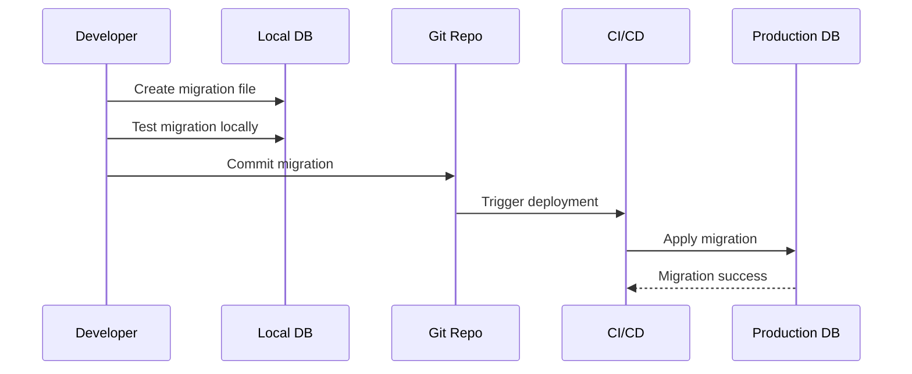
```mermaid
sequenceDiagram
    participant Dev as Developer
    participant Local as Local DB
    participant Git as Git Repo
    participant CI as CI/CD
    participant Prod as Production DB
    
    Dev->>Local: Create migration file
    Dev->>Local: Test migration locally
    Dev->>Git: Commit migration
    Git->>CI: Trigger deployment
    CI->>Prod: Apply migration
    Prod-->>CI: Migration success
```

#### Rules for Safe Migrations

1. **Never edit existing migrations**
   - ❌ Don't modify files already in Git
   - ✅ Create new migration to fix issues

2. **Always include rollback plan**
```sql
-- Migration: Add column
ALTER TABLE courses ADD COLUMN priority INTEGER DEFAULT 0;

-- Rollback (document in comments):
-- ALTER TABLE courses DROP COLUMN priority;
```

3. **Test migrations locally first**
```bash
# Reset local DB and apply all migrations
supabase db reset

# Check if app still works
npm run dev
```

4. **Use transactions for complex migrations**
```sql
BEGIN;

-- Multiple operations
ALTER TABLE x ADD COLUMN y;
UPDATE x SET y = default_value;
ALTER TABLE x ALTER COLUMN y SET NOT NULL;

COMMIT;
```

5. **Add indexes for performance**
```sql
-- Create index on frequently queried columns
CREATE INDEX idx_courses_teacher_id ON courses(teacher_id);
CREATE INDEX idx_enrollments_student_course ON enrollments(student_id, course_id);
```

6. **Backward compatible changes**
```sql
-- ✅ Good: Add nullable column first
ALTER TABLE courses ADD COLUMN category TEXT;

-- Later migration: Make it required
UPDATE courses SET category = 'General' WHERE category IS NULL;
ALTER TABLE courses ALTER COLUMN category SET NOT NULL;
```

---

### Code Style & Best Practices

#### Component Structure

```tsx
// ✅ Good: Organized component structure
import { useState } from 'react';
import { useQuery } from '@tanstack/react-query';
import { supabase } from '@/integrations/supabase/client';
import { Button } from '@/components/ui/button';
import { Card } from '@/components/ui/card';

interface ComponentProps {
  courseId: string;
  onComplete?: () => void;
}

export default function ComponentName({ courseId, onComplete }: ComponentProps) {
  // 1. Hooks first
  const [localState, setLocalState] = useState(false);
  const { data, isLoading } = useQuery(/* ... */);
  
  // 2. Handlers
  const handleClick = () => {
    // handler logic
  };
  
  // 3. Early returns
  if (isLoading) return <div>Loading...</div>;
  if (!data) return null;
  
  // 4. Main render
  return (
    <Card>
      <h2>{data.title}</h2>
      <Button onClick={handleClick}>Action</Button>
    </Card>
  );
}
```

#### Hook Patterns

```tsx
// ✅ Good: Consistent hook pattern
export function useResourceName(id?: string) {
  const { user } = useAuth();
  const queryClient = useQueryClient();
  
  // Query
  const { data, isLoading, error } = useQuery({
    queryKey: ['resource', id],
    queryFn: async () => {
      const { data, error } = await supabase
        .from('table')
        .select('*')
        .eq('id', id)
        .single();
      
      if (error) throw error;
      return data;
    },
    enabled: !!id && !!user,
  });
  
  // Real-time subscription
  useEffect(() => {
    if (!user) return;
    
    const channel = supabase
      .channel('resource-changes')
      .on('postgres_changes', {
        event: '*',
        schema: 'public',
        table: 'table',
      }, () => {
        queryClient.invalidateQueries({ queryKey: ['resource'] });
      })
      .subscribe();
    
    return () => supabase.removeChannel(channel);
  }, [user, queryClient]);
  
  return { data, isLoading, error };
}
```

#### Naming Conventions

```tsx
// Components: PascalCase
export default function StudentDashboard() {}

// Hooks: camelCase with 'use' prefix
export function useCourseData() {}

// Constants: UPPER_SNAKE_CASE
const MAX_UPLOAD_SIZE = 10 * 1024 * 1024; // 10 MB

// Functions: camelCase
function calculateGrade(score: number, total: number) {}

// Types/Interfaces: PascalCase
interface CourseData {
  id: string;
  title: string;
}

// Files: Match export name
// StudentDashboard.tsx exports StudentDashboard
// useCourseData.ts exports useCourseData
```

---

### Git Workflow

#### Branch Naming

```bash
# Features
git checkout -b feature/course-analytics
git checkout -b feature/attendance-tracker

# Bug fixes
git checkout -b fix/enrollment-button
git checkout -b fix/rls-policy-students

# Migrations
git checkout -b migration/add-ratings-table
```

#### Commit Messages

```bash
# ✅ Good commit messages
git commit -m "feat: add course analytics page"
git commit -m "fix: resolve RLS policy for student enrollments"
git commit -m "docs: update ARCHITECTURE.md with Phase 3"
git commit -m "refactor: extract exam grading logic to hook"

# ❌ Bad commit messages
git commit -m "update"
git commit -m "fix bug"
git commit -m "changes"
```

#### Pull Request Workflow

1. **Create feature branch**
```bash
git checkout -b feature/new-feature
```

2. **Make changes and commit**
```bash
git add .
git commit -m "feat: add new feature"
```

3. **Push to remote**
```bash
git push origin feature/new-feature
```

4. **Create PR with description**
   - What changed
   - Why it changed
   - How to test
   - Screenshots (if UI change)

5. **Address review comments**
```bash
git add .
git commit -m "refactor: address PR feedback"
git push origin feature/new-feature
```

---

### Testing Strategy

#### Manual Testing Checklist

**Before committing:**
- [ ] Page loads without errors
- [ ] Forms validate correctly
- [ ] Success/error states display properly
- [ ] Mobile responsive (test at 375px width)
- [ ] Dark mode works
- [ ] i18n works (test EN and ID)
- [ ] Real-time updates work
- [ ] RLS policies enforced

**For database changes:**
- [ ] Migration runs successfully
- [ ] Rollback tested
- [ ] RLS policies verified
- [ ] Realtime enabled if needed
- [ ] Types regenerated

---

### Performance Tips

1. **Optimize Query Keys**
```tsx
// ✅ Good: Specific cache keys
queryKey: ['courses', userId, { status: 'published' }]

// ❌ Bad: Too generic
queryKey: ['courses']
```

2. **Use React.memo for expensive components**
```tsx
export const ExpensiveComponent = React.memo(({ data }) => {
  // Complex rendering logic
  return <div>{/* ... */}</div>;
});
```

3. **Lazy load routes**
```tsx
// App.tsx
const TeacherOverview = lazy(() => import('@/pages/teacher/Overview'));

<Route 
  path="overview" 
  element={
    <Suspense fallback={<Loading />}>
      <TeacherOverview />
    </Suspense>
  } 
/>
```

4. **Optimize images**
```tsx
// Use appropriate image sizes

```

---

### Still to Come (Future Phase)

**Phase 4:** Advanced Topics
- Performance optimization strategies
- Error handling patterns
- Testing strategies
- Deployment architecture

---

**Document Version:** 3.0.0  
**Last Updated:** February 4, 2026  
**Focus:** Complete Architecture Documentation (Phase 1 + 2 + 3)
