# Project Flowcharts

Berikut adalah flowchart detail untuk setiap menu yang tersedia dalam aplikasi Classroom Companion, dikategorikan berdasarkan role pengguna.

## 1. Flowchart Guru (Teacher)

### Overview Alur Utama
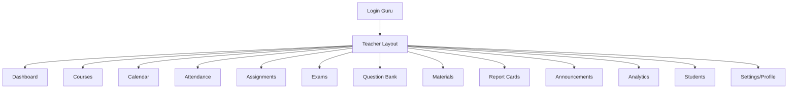

### Detail Per Menu

#### Courses (Manajemen Kursus)
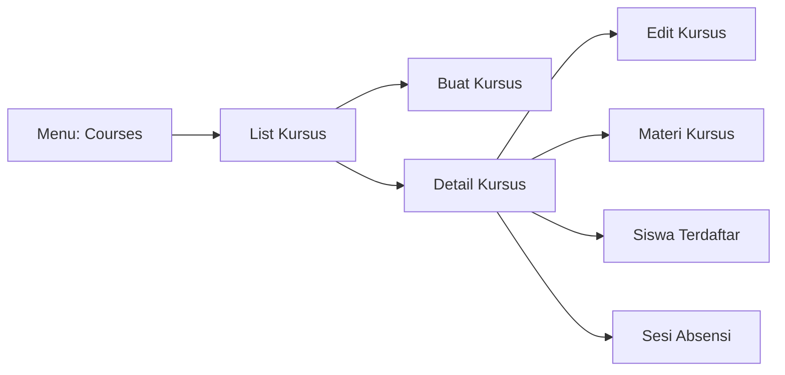

#### Exams (Manajemen Ujian)
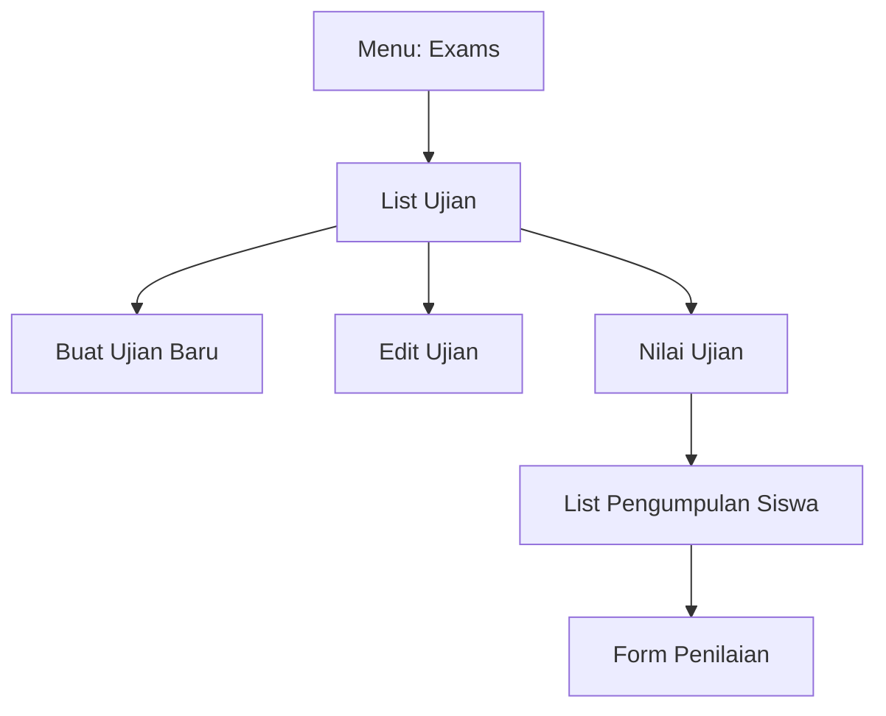

#### Assignments (Manajemen Tugas)
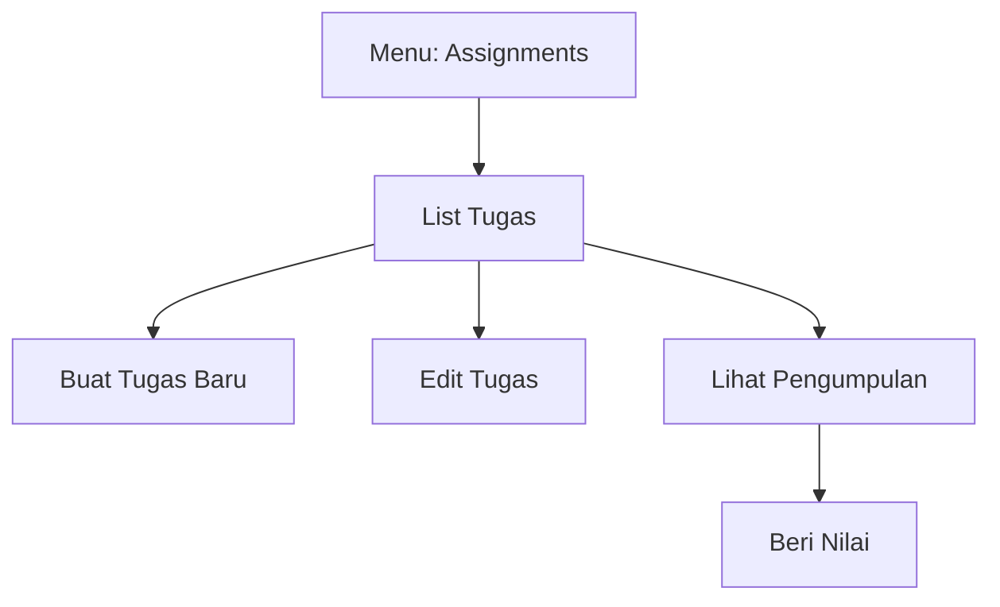

#### Question Bank (Bank Soal)
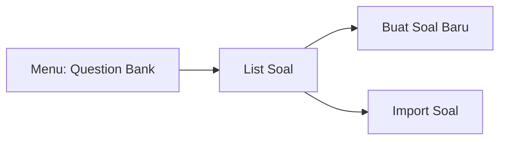

#### Materials (Materi Pembelajaran)
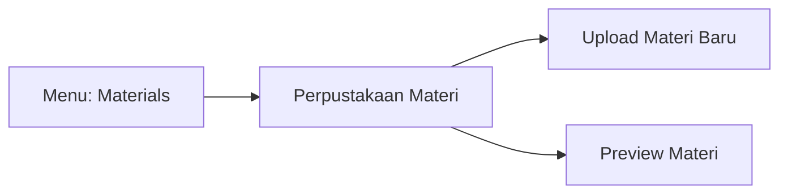

#### Report Cards (Rapor Siswa)
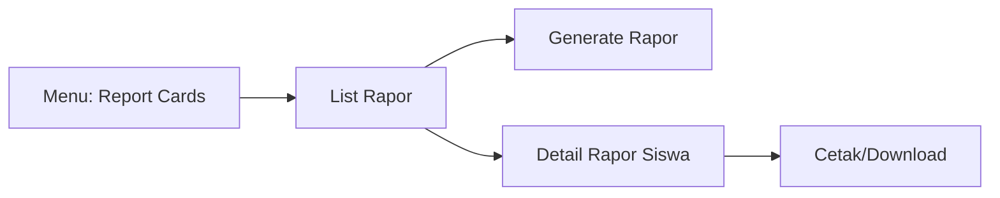

#### Attendance (Absensi)
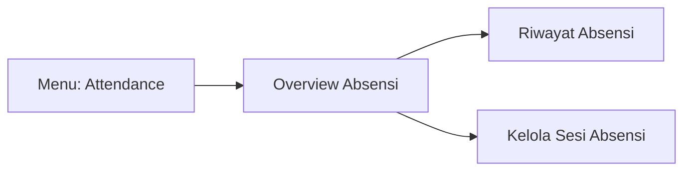

#### Analytics (Analistik)
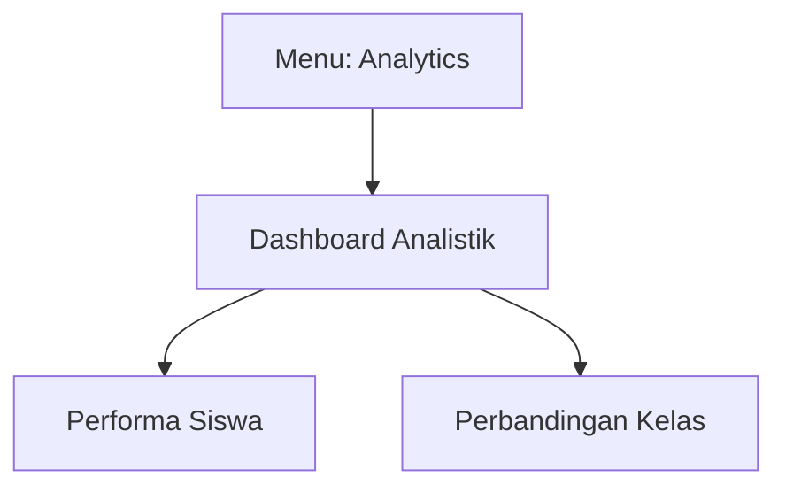

#### Students (Daftar Siswa)
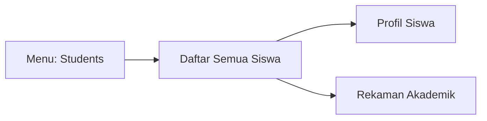

#### Announcements (Pengumuman)
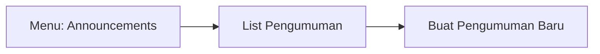

#### Calendar (Kalender)
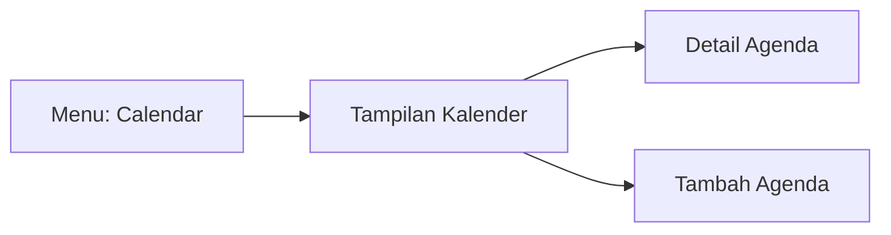

---

## 2. Flowchart Siswa (Student)

### Overview Alur Utama
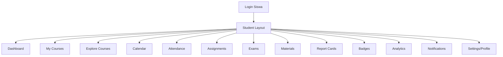

### Detail Per Menu

#### My Courses (Kursus Saya)
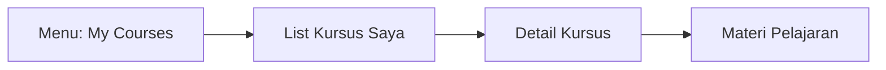

#### Explore Courses (Cari Kursus)
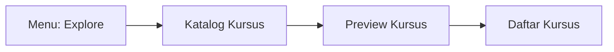

#### Exams (Ujian)
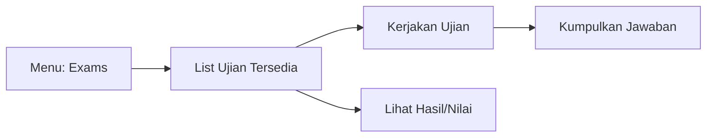

#### Assignments (Tugas)
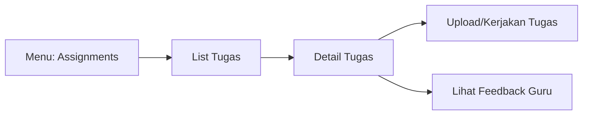

#### Materials (Materi)
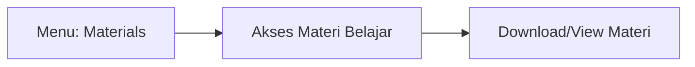

#### Report Cards (Laporan Hasil Belajar)
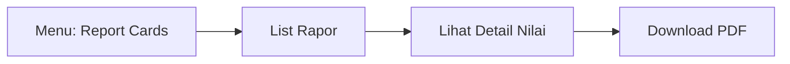

#### Badges (Pencapaian)
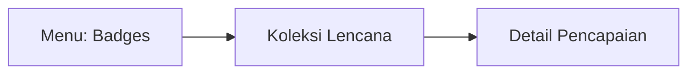

#### Analytics (Analistik Belajar)
```mermaid
graph LR
    Nav["Menu: Analytics"] --> Overview[Progress Belajar]
    Overview --> Grades[Grafik Nilai]
    Overview --> Activity[Aktivitas Belajar]
```

#### Attendance (Kehadiran)
```mermaid
graph LR
    Nav["Menu: Attendance"] --> History[Riwayat Kehadiran]
    History --> Statistics[Statistik Kehadiran]
```

#### Calendar (Jadwal)
```mermaid
graph LR
    Nav["Menu: Calendar"] --> View[Lihat Jadwal]
    View --> ExamDates[Jadwal Ujian]
    View --> DueDates[Tenggat Tugas]
```

---

## 3. Flowchart Orang Tua (Parent)

### Overview Alur Utama
```mermaid
graph TD
    ParentLogin[Login Orang Tua] --> Layout[Parent Layout]
    Layout --> Dashboard[Dashboard]
    Layout --> AddChild[Add Child]
    Layout --> Notifications[Notifications]
    Layout --> Settings["Settings/Profile"]
    Dashboard --> ChildDetail[Detail Anak]
```

### Detail Per Menu

#### Children Overview (Dashboard Anak)
```mermaid
graph TD
    Nav["Menu: Dashboard"] --> ChildList[List Anak]
    ChildList --> ChildDetail[Dashboard Anak]
    ChildDetail --> ChildAttendance[Lihat Absensi]
    ChildDetail --> ChildAssignments[Lihat Tugas]
    ChildDetail --> ChildExams[Lihat Nilai Ujian]
    ChildDetail --> ChildCourses[Lihat Kursus]
```

#### Add Child (Tambah Anak)
```mermaid
graph LR
    Nav["Menu: Add Child"] --> Search["Cari Siswa (Kode/ID)"]
    Search --> Link[Hubungkan Akun]
```

#### Notifications (Notifikasi)
```mermaid
graph LR
    Nav["Menu: Notifications"] --> List[Inbox Notifikasi]
    List --> MarkRead[Tandai Dibaca]
```
