# Database Schema

Berikut adalah visualisasi struktur database Classroom Companion menggunakan Mermaid Entity Relationship Diagram (ERD).

## Entity Relationship Diagram

```mermaid
erDiagram
    %% User Management
    profiles {
        uuid id PK
        uuid user_id UK
        string email
        string name
        string role "teacher, student, parent, operator"
    }
    
    user_roles {
        uuid id PK
        uuid user_id FK
        string role "enum: teacher, student, parent, operator"
    }

    academic_periods {
        uuid id PK
        string name
        string academic_year
        integer semester
        date start_date
        date end_date
        boolean is_active
        uuid created_by FK
    }

    classes {
        uuid id PK
        string name
        integer grade_level
        uuid homeroom_teacher_id FK
        uuid academic_year_id FK
    }

    class_students {
        uuid id PK
        uuid class_id FK
        uuid student_id FK
    }

    class_schedules {
        uuid id PK
        uuid class_id FK
        uuid course_id FK
        uuid teacher_id FK
        integer day_of_week
        time start_time
        time end_time
        string room
    }

    student_pairing_codes {
        uuid id PK
        uuid student_user_id FK
        string code
        boolean is_active
    }

    parent_child_relationships {
        uuid id PK
        uuid parent_user_id FK
        uuid student_user_id FK
        boolean is_active
    }

    %% Course Management
    courses {
        uuid id PK
        string title
        uuid teacher_id FK
        string status "draft, published"
        jsonb settings
    }

    enrollments {
        uuid id PK
        uuid student_id FK
        uuid course_id FK
        timestamp enrolled_at
    }

    course_materials {
        uuid id PK
        uuid course_id FK
        string title
        string type "pdf, video, link"
        string url
    }

    %% Assessment (Exams & Assignments)
    exams {
        uuid id PK
        uuid course_id FK
        uuid class_id FK
        string title
        integer duration
        integer total_points
        string status
    }

    questions {
        uuid id PK
        uuid exam_id FK
        string type "multiple-choice, essay"
        string question
        jsonb options
        integer points
    }

    exam_submissions {
        uuid id PK
        uuid exam_id FK
        uuid student_id FK
        jsonb answers
        integer score
        boolean graded
    }

    assignments {
        uuid id PK
        uuid course_id FK
        uuid class_id FK
        string title
        timestamp due_date
        integer total_points
    }
    
    assignment_submissions {
        uuid id PK
        uuid assignment_id FK
        uuid student_id FK
        text content
        string file_url
        integer grade
    }

    question_bank {
        uuid id PK
        uuid teacher_id FK
        string topic
        string question
        string type
    }

    %% Attendance
    attendance_sessions {
        uuid id PK
        uuid course_id FK
        uuid class_id FK
        uuid teacher_id FK
        timestamp open_time
        timestamp close_time
        string status "open, closed"
    }

    attendance_records {
        uuid id PK
        uuid session_id FK
        uuid student_id FK
        string status "present, absent, late, excused"
        timestamp check_in_time
    }

    attendance_excuses {
        uuid id PK
        uuid student_id FK
        uuid course_id FK
        date start_date
        date end_date
        string reason
        string status "pending, approved, rejected"
    }

    %% System & Reporting
    notifications {
        uuid id PK
        uuid user_id FK
        string type
        string title
        string message
        boolean read
    }

    announcements {
        uuid id PK
        uuid course_id FK
        uuid class_id FK
        uuid teacher_id FK
        string title
        string content
    }

    school_announcements {
        uuid id PK
        uuid author_id FK
        string title
        string content
        boolean is_pinned
        text[] target_roles
    }

    report_cards {
        uuid id PK
        uuid student_id FK
        uuid course_id FK
        uuid academic_period_id FK
        decimal final_grade
        decimal attendance_grade
    }

    %% Relationships
    profiles ||--o{ user_roles : "has"
    profiles ||--o{ courses : "teaches"
    profiles ||--o{ enrollments : "enrolls"
    
    %% Parent-Child
    profiles ||--o{ parent_child_relationships : "parent of"
    profiles ||--o{ parent_child_relationships : "child of"
    profiles ||--o{ student_pairing_codes : "has code"

    %% Courses
    courses ||--o{ enrollments : "has students"
    courses ||--o{ exams : "has"
    courses ||--o{ assignments : "has"
    courses ||--o{ course_materials : "contains"
    courses ||--o{ attendance_sessions : "has"
    courses ||--o{ announcements : "has"

    %% Exams
    exams ||--o{ questions : "contains"
    exams ||--o{ exam_submissions : "receives"
    profiles ||--o{ exam_submissions : "submits"

    %% Assignments
    assignments ||--o{ assignment_submissions : "receives"
    profiles ||--o{ assignment_submissions : "submits"

    %% Attendance
    attendance_sessions ||--o{ attendance_records : "logs"
    profiles ||--o{ attendance_records : "attend"

    %% Academic Operations (Operator)
    academic_periods ||--o{ classes : "contains"
    classes ||--o{ class_students : "has"
    classes ||--o{ class_schedules : "scheduled for"
    courses ||--o{ class_schedules : "part of"
    profiles ||--o{ class_students : "belongs to"
    profiles ||--o{ class_schedules : "teaches"
    profiles ||--o{ school_announcements : "authors"
    academic_periods ||--o{ report_cards : "belongs to"
    courses ||--o{ classes : "assigned to"
```

## Description of Modules

### 1. User Management
*   **profiles**: Menyimpan data dasar pengguna (nama, email, avatar).
*   **user_roles**: Menentukan role pengguna (Teacher, Student, Parent, Operator).
*   **parent_child_relationships**: Menghubungkan akun orang tua dengan siswa.
*   **student_pairing_codes**: Kode unik untuk menghubungkan siswa dengan orang tua.

### 2. Academic & Operational (Operator)
*   **academic_periods**: Manajemen semester dan tahun ajaran.
*   **classes**: Tabel Rombongan Belajar (e.g. X-IPA-1).
*   **class_students**: Daftar siswa per kelas.
*   **class_schedules**: Jadwal pelajaran harian.
*   **school_announcements**: Pengumuman untuk seluruh sekolah dengan target role tertentu.

### 3. Course Management
*   **courses**: Tabel utama untuk data kursus/mata pelajaran.
*   **enrollments**: Mencatat siswa yang mengambil kursus tertentu.
*   **course_materials**: Materi pelajaran (PDF, Video, Link) yang diunggah guru.

### 4. Assessments
*   **exams** & **questions**: Modul ujian dan bank soal.
*   **exam_submissions**: Jawaban siswa dan nilai ujian.
*   **assignments**: Tugas-tugas yang diberikan guru.
*   **assignment_submissions**: Pengumpulan tugas siswa.

### 5. Attendance
*   **attendance_sessions**: Sesi absensi yang dibuka oleh guru (per pertemuan).
*   **attendance_records**: Status kehadiran siswa per sesi (Hadir, Izin, Alpha).
*   **attendance_excuses**: Pengajuan izin/sakit dari siswa/orang tua.

### 6. Reporting
*   **report_cards**: Rekap nilai akhir dan kehadiran siswa per periode akademik.
*   **notifications**: Sistem notifikasi pengguna.
