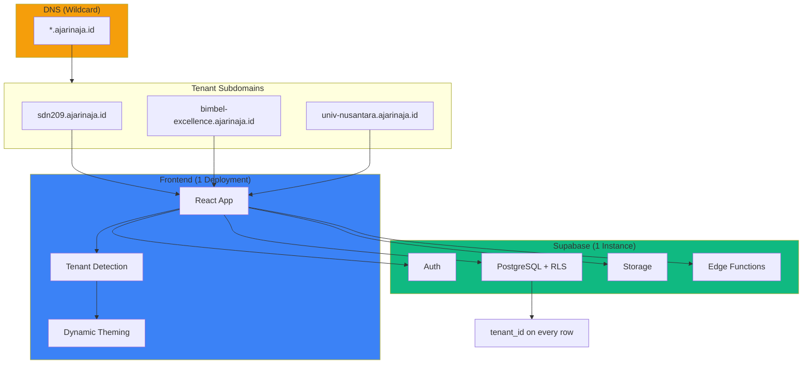
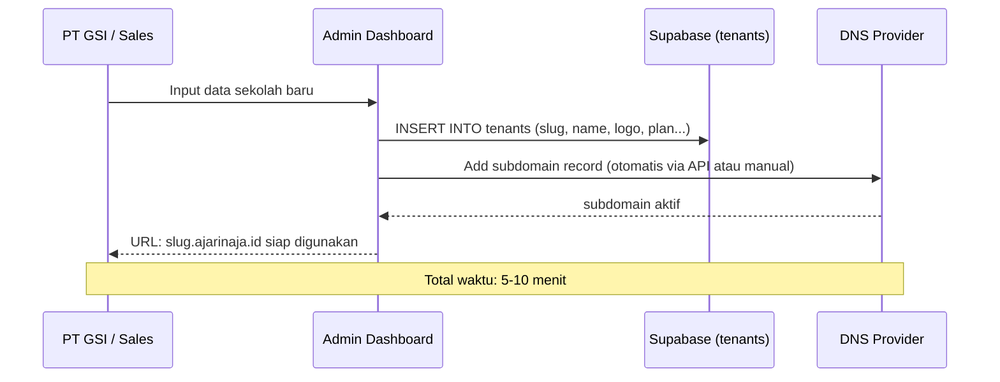

# Multi-Tenant Architecture: AjarinAja SaaS

> **Tanggal**: 22 Februari 2026
> **Status**: Proposal — belum diimplementasi
> **Tujuan**: Arsitektur untuk menjalankan AjarinAja sebagai SaaS multi-tenant, di mana setiap institusi (sekolah, kursus, kampus) mendapat subdomain sendiri dengan data terisolasi.

---

## 1. Ringkasan Keputusan

| Keputusan | Pilihan |
|-----------|---------|
| **Model tenancy** | Shared multi-tenant (1 database, 1 deployment) |
| **Isolasi data** | Row-Level Security (RLS) berbasis `tenant_id` |
| **Branding** | Subdomain-based (`slug.ajarinaja.id`) + config dinamis |
| **Hosting frontend** | 1 deployment, wildcard subdomain |
| **Hosting backend** | 1 Supabase project (shared) |
| **Dedicated instance** | Tersedia untuk tier Enterprise sebagai upsell |

### Kenapa Shared, Bukan Isolated?

```
Isolated (1 server/tenant)          Shared Multi-Tenant
┌──────┐ ┌──────┐ ┌──────┐         ┌──────────────────┐
│ DB 1 │ │ DB 2 │ │ DB 3 │         │   1 Database     │
│ App1 │ │ App2 │ │ App3 │         │   1 App Deploy   │
└──────┘ └──────┘ └──────┘         │   RLS isolation  │
 $25/mo   $25/mo   $25/mo          └──────────────────┘
 = $75/mo untuk 3 tenant            = $25/mo TOTAL

 ❌ 10 tenant = $250/mo              ✅ 10 tenant = $25/mo
 ❌ Update 10 instance               ✅ Update 1x
 ❌ 10 migration runs                ✅ 1 migration run
```

---

## 2. Arsitektur Overview



---

## 3. Database Schema Changes

### 3.1 Tabel `tenants` (BARU)

```sql
CREATE TABLE tenants (
    id UUID PRIMARY KEY DEFAULT gen_random_uuid(),
    slug TEXT UNIQUE NOT NULL,              -- "sdn209mantaipi" (subdomain)
    name TEXT NOT NULL,                      -- "SDN 209 Mantaipi"
    logo_url TEXT,                            -- URL logo institusi
    primary_color TEXT DEFAULT '#4F46E5',     -- Warna utama branding
    secondary_color TEXT DEFAULT '#10B981',
    plan TEXT NOT NULL DEFAULT 'pro'          -- 'lite', 'pro', 'enterprise'
        CHECK (plan IN ('lite', 'pro', 'enterprise')),
    max_students INTEGER DEFAULT 30,         -- Limit berdasarkan plan
    max_teachers INTEGER DEFAULT 5,
    custom_domain TEXT,                      -- Optional: "lms.sdn209.sch.id"
    is_active BOOLEAN DEFAULT true,
    contact_email TEXT,
    contact_phone TEXT,
    created_at TIMESTAMPTZ DEFAULT now(),
    updated_at TIMESTAMPTZ DEFAULT now()
);

-- Index untuk lookup subdomain (paling sering diakses)
CREATE INDEX idx_tenants_slug ON tenants(slug);
CREATE INDEX idx_tenants_custom_domain ON tenants(custom_domain) WHERE custom_domain IS NOT NULL;
```

### 3.2 Menambah `tenant_id` ke Tabel Existing

Tabel yang perlu ditambah `tenant_id`:

```sql
-- Core tables
ALTER TABLE profiles ADD COLUMN tenant_id UUID REFERENCES tenants(id);
ALTER TABLE courses ADD COLUMN tenant_id UUID REFERENCES tenants(id);
ALTER TABLE enrollments ADD COLUMN tenant_id UUID REFERENCES tenants(id);

-- Assessment
ALTER TABLE exams ADD COLUMN tenant_id UUID REFERENCES tenants(id);
ALTER TABLE assignments ADD COLUMN tenant_id UUID REFERENCES tenants(id);
ALTER TABLE question_bank ADD COLUMN tenant_id UUID REFERENCES tenants(id);

-- Attendance
ALTER TABLE attendance_sessions ADD COLUMN tenant_id UUID REFERENCES tenants(id);

-- System
ALTER TABLE notifications ADD COLUMN tenant_id UUID REFERENCES tenants(id);
ALTER TABLE announcements ADD COLUMN tenant_id UUID REFERENCES tenants(id);
ALTER TABLE academic_periods ADD COLUMN tenant_id UUID REFERENCES tenants(id);

-- Add indexes
CREATE INDEX idx_profiles_tenant ON profiles(tenant_id);
CREATE INDEX idx_courses_tenant ON courses(tenant_id);
CREATE INDEX idx_enrollments_tenant ON enrollments(tenant_id);
-- ... dst untuk semua tabel
```

### 3.3 RLS Policies (Tenant Isolation)

```sql
-- Helper function: get current user's tenant_id
CREATE OR REPLACE FUNCTION current_tenant_id()
RETURNS UUID AS $$
    SELECT tenant_id FROM profiles WHERE user_id = auth.uid()
$$ LANGUAGE sql SECURITY DEFINER STABLE;

-- Apply to all tenant-scoped tables
-- Contoh: courses
ALTER TABLE courses ENABLE ROW LEVEL SECURITY;

CREATE POLICY "tenant_isolation_select" ON courses
    FOR SELECT USING (tenant_id = current_tenant_id());

CREATE POLICY "tenant_isolation_insert" ON courses
    FOR INSERT WITH CHECK (tenant_id = current_tenant_id());

CREATE POLICY "tenant_isolation_update" ON courses
    FOR UPDATE USING (tenant_id = current_tenant_id());

CREATE POLICY "tenant_isolation_delete" ON courses
    FOR DELETE USING (tenant_id = current_tenant_id());
```

> **Penting**: RLS memastikan bahwa walaupun semua data ada di 1 database, user dari SDN 209 **tidak bisa** lihat data dari Bimbel Excellence. Ini isolation di level database, bukan aplikasi.

### 3.4 Signup Flow (Tenant-Aware)

```sql
-- Trigger: auto-assign tenant_id saat user signup via subdomain
CREATE OR REPLACE FUNCTION assign_tenant_on_signup()
RETURNS TRIGGER AS $$
DECLARE
    v_tenant_id UUID;
    v_slug TEXT;
BEGIN
    -- Slug dikirim via user metadata saat signup
    v_slug := NEW.raw_user_meta_data ->> 'tenant_slug';

    IF v_slug IS NOT NULL THEN
        SELECT id INTO v_tenant_id FROM tenants WHERE slug = v_slug AND is_active = true;

        IF v_tenant_id IS NOT NULL THEN
            -- Update profile with tenant_id
            UPDATE profiles SET tenant_id = v_tenant_id WHERE user_id = NEW.id;
        END IF;
    END IF;

    RETURN NEW;
END;
$$ LANGUAGE plpgsql SECURITY DEFINER;
```

---

## 4. Frontend Changes

### 4.1 Tenant Detection (`src/lib/tenant.ts`)

```typescript
export interface TenantConfig {
    id: string;
    slug: string;
    name: string;
    logoUrl: string | null;
    primaryColor: string;
    secondaryColor: string;
    plan: 'lite' | 'pro' | 'enterprise';
}

/**
 * Extract tenant slug from current URL.
 * sdn209.ajarinaja.id → "sdn209"
 * localhost:8080 → "default" (development)
 */
export function getTenantSlug(): string {
    const hostname = window.location.hostname;

    // Development mode
    if (hostname === 'localhost' || hostname === '127.0.0.1') {
        return localStorage.getItem('dev_tenant_slug') || 'default';
    }

    // Production: extract subdomain
    // sdn209.ajarinaja.id → ["sdn209", "ajarinaja", "id"]
    const parts = hostname.split('.');
    if (parts.length >= 3) {
        return parts[0];
    }

    return 'default'; // main domain → landing page
}

/**
 * Fetch tenant configuration from Supabase.
 */
export async function fetchTenantConfig(slug: string): Promise<TenantConfig | null> {
    const { data, error } = await supabase
        .from('tenants')
        .select('*')
        .eq('slug', slug)
        .eq('is_active', true)
        .single();

    if (error || !data) return null;

    return {
        id: data.id,
        slug: data.slug,
        name: data.name,
        logoUrl: data.logo_url,
        primaryColor: data.primary_color,
        secondaryColor: data.secondary_color,
        plan: data.plan,
    };
}
```

### 4.2 Tenant Context (`src/contexts/TenantContext.tsx`)

```typescript
const TenantContext = createContext<TenantConfig | null>(null);

export function TenantProvider({ children }: { children: React.ReactNode }) {
    const [tenant, setTenant] = useState<TenantConfig | null>(null);
    const [isLoading, setIsLoading] = useState(true);

    useEffect(() => {
        const slug = getTenantSlug();

        if (slug === 'default') {
            // Main domain → show landing/marketing page
            setIsLoading(false);
            return;
        }

        fetchTenantConfig(slug).then((config) => {
            if (config) {
                setTenant(config);
                // Apply dynamic theme
                document.documentElement.style.setProperty('--primary', config.primaryColor);
                document.documentElement.style.setProperty('--secondary', config.secondaryColor);
                document.title = config.name;
            }
            setIsLoading(false);
        });
    }, []);

    if (isLoading) return <LoadingScreen />;
    return <TenantContext.Provider value={tenant}>{children}</TenantContext.Provider>;
}

export const useTenant = () => useContext(TenantContext);
```

### 4.3 Signup dengan Tenant Context

```typescript
// Saat signup, sertakan tenant_slug di metadata
const handleSignup = async (email: string, password: string, name: string, role: string) => {
    const tenant = useTenant();

    const { data, error } = await supabase.auth.signUp({
        email,
        password,
        options: {
            data: {
                name,
                role,
                tenant_slug: tenant?.slug || 'default',
            },
        },
    });
};
```

### 4.4 Provider Hierarchy (Updated)

```
<QueryClientProvider>
  <TenantProvider>          ← BARU: detect subdomain, load config
    <AuthProvider>
      <TooltipProvider>
        <Toaster />
        <BrowserRouter>
          <Routes />
        </BrowserRouter>
      </TooltipProvider>
    </AuthProvider>
  </TenantProvider>
</QueryClientProvider>
```

---

## 5. Onboarding Flow (New Tenant)

Ketika ada closing baru dari PT GSI:



### Checklist Onboarding

1. `INSERT INTO tenants` — nama, slug, logo, warna, plan
2. DNS wildcard sudah ter-setup (1x saja, `*.ajarinaja.id` → server)
3. Beri URL ke klien: `slug.ajarinaja.id`
4. Guru pertama signup → otomatis ter-assign ke tenant

---

## 6. Feature Gating (Berdasarkan Plan)

```typescript
// hooks/useFeatureGate.ts
export function useFeatureGate() {
    const tenant = useTenant();

    return {
        canUseAttendance: tenant?.plan !== 'lite',
        canUseAtRiskDetection: tenant?.plan === 'enterprise',
        canUseAnalytics: tenant?.plan !== 'lite',
        canUseAIGeneration: true, // all plans, fair usage
        canUseMultiDepartment: tenant?.plan === 'enterprise',
        canUseAPI: tenant?.plan === 'enterprise',
        maxStudents: tenant?.plan === 'lite' ? 30 : Infinity,
    };
}

// Usage in component
function AttendancePage() {
    const { canUseAttendance } = useFeatureGate();

    if (!canUseAttendance) {
        return <UpgradePrompt feature="Attendance" requiredPlan="pro" />;
    }

    return <AttendanceView />;
}
```

---

## 7. Scaling Strategy

### Phase 1: 1-50 Tenants (SEKARANG)

```
1 Supabase Pro ($25/mo)
1 Frontend deploy (Netlify free)
Wildcard DNS
= Total: ~$25/mo
```

### Phase 2: 50-200 Tenants

```
1 Supabase Pro (maybe upgrade storage/bandwidth)
Add connection pooling (Supavisor)
Add CDN (Cloudflare, free)
= Total: ~$50-75/mo
```

### Phase 3: 200+ Tenants

```
Supabase Team plan atau self-hosted
Read replicas untuk query-heavy operations
Dedicated instances untuk Enterprise clients
= Total: berdasarkan usage
```

### Phase 4: Enterprise Dedicated (Opsional)

Untuk klien yang bayar Rp 25 juta+/bulan dan minta dedicated:

```
Dedicated Supabase project
Isolated database
Custom domain (lms.univnusantara.ac.id)
= Biaya: $25-50/mo Supabase + premium charge ke klien
```

---

## 8. Data Migration Strategy

Untuk migrasi dari single-tenant (sekarang) ke multi-tenant:

### Step 1: Create `tenants` table dan insert default tenant

```sql
INSERT INTO tenants (id, slug, name, plan)
VALUES ('00000000-0000-0000-0000-000000000001', 'default', 'AjarinAja (Default)', 'enterprise');
```

### Step 2: Add `tenant_id` columns (nullable dulu)

```sql
ALTER TABLE profiles ADD COLUMN tenant_id UUID REFERENCES tenants(id);
-- ... semua tabel
```

### Step 3: Backfill existing data

```sql
UPDATE profiles SET tenant_id = '00000000-0000-0000-0000-000000000001' WHERE tenant_id IS NULL;
-- ... semua tabel
```

### Step 4: Make `tenant_id` NOT NULL

```sql
ALTER TABLE profiles ALTER COLUMN tenant_id SET NOT NULL;
-- ... semua tabel
```

### Step 5: Update RLS policies

Replace existing policies → tambah `tenant_id = current_tenant_id()` condition.

---

## 9. Security Considerations

| Concern | Mitigation |
|---------|-----------|
| **Cross-tenant data leak** | RLS di level database — bahkan kalau frontend bug, DB tetap block |
| **Tenant admin escalation** | Role check + tenant check di setiap policy |
| **Subdomain spoofing** | Validate slug exists di `tenants` table sebelum serve |
| **Inactive tenant access** | `is_active` flag, di-check di `fetchTenantConfig` |
| **Data export** | Tenant admin bisa export data sendiri, scoped ke `tenant_id` |

---

## 10. Monitoring & Observability

### Per-Tenant Metrics

```sql
-- View: usage per tenant
CREATE VIEW tenant_usage AS
SELECT
    t.slug,
    t.name,
    t.plan,
    (SELECT COUNT(*) FROM profiles p WHERE p.tenant_id = t.id) AS total_users,
    (SELECT COUNT(*) FROM courses c WHERE c.tenant_id = t.id) AS total_courses,
    (SELECT COUNT(*) FROM exams e WHERE e.tenant_id = t.id) AS total_exams
FROM tenants t
WHERE t.is_active = true;
```

---

## Appendix: Cost Comparison at Scale

| Tenants | Isolated ($25/tenant) | Shared Multi-Tenant |
|---------|----------------------|---------------------|
| 5 | $125/mo (Rp 2 juta) | **$25/mo (Rp 400rb)** |
| 10 | $250/mo (Rp 4 juta) | **$25/mo (Rp 400rb)** |
| 50 | $1.250/mo (Rp 20 juta) | **$50/mo (Rp 800rb)** |
| 100 | $2.500/mo (Rp 40 juta) | **$75/mo (Rp 1.2 juta)** |
| 200 | $5.000/mo (Rp 80 juta) | **$100/mo (Rp 1.6 juta)** |

**Savings at 100 tenants: Rp 38.8 juta/bulan** → ini langsung jadi profit margin lo.
